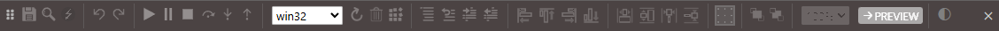
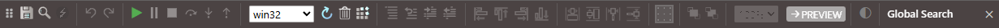
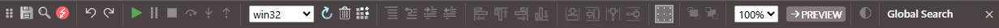
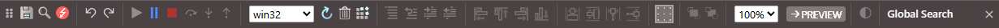

# Toolbar

- Save All Changes (<kbd>CTRL</kbd> + <kbd>S</kbd>)
- Find In Project... (<kbd>CTRL</kbd> + <kbd>SHIFT</kbd> + <kbd>F</kbd>) (<kbd>CTRL</kbd> + <kbd>⇧</kbd> + <kbd>F</kbd>)
- Switch Between Form And Code
- Undo
- Redo
- Start / Continue (<kbd>F5</kbd>)
- Break Into Code (<kbd>CTRL</kbd> + <kbd>BREAK</kbd>)
- Stop
- Step Over (<kbd>SHIFT</kbd> + <kbd>F8</kbd> / <kbd>F10</kbd>)
- Step Into (<kbd>F8</kbd> / <kbd>F10</kbd>)
- Step Out (<kbd>CTRL</kbd> + <kbd>SHIFT</kbd> + <kbd>F8</kbd> / <kbd>SHIFT</kbd> + <kbd>F11</kbd>)
- Choose a build configuration
- Restart the compiler
- Clean (Deregister & delete build)
- Build
- Comment Selection (<kbd>CTRL</kbd> + <kbd>K</kbd>)
- Uncomment Selection (<kbd>CTRL</kbd> + <kbd>SHIFT</kbd> + <kbd>K</kbd>)
- Indent Block (<kbd>CTRL</kbd> + <kbd>[</kbd>)
- Outdent Block (<kbd>CTRL</kbd> + <kbd>]</kbd>)
- Align controls to the LEFT (<kbd>ALT</kbd> + <kbd>ARROWLEFT</kbd>)
- Align controls to the TOP (<kbd>ALT</kbd> + <kbd>ARROWUP</kbd>)
- Align controls to the RIGHT (<kbd>ALT</kbd> + <kbd>ARROWRIGHT</kbd>)
- Align controls to the DOWN (<kbd>ALT</kbd> + <kbd>ARROWDOWN</kbd>)
- Resize controls to the WIDEST (<kbd>CTRL</kbd> + <kbd>SHIFT</kbd> + <kbd>ARROWRIGHT</kbd>)
- Resize controls to the TALLEST (<kbd>CTRL</kbd> + <kbd>SHIFT</kbd> + <kbd>ARROWDOWN</kbd>)
- Resize controls to the NARROWEST (<kbd>CTRL</kbd> + <kbd>SHIFT</kbd> + <kbd>ARROWLEFT</kbd>)
- Resize controls to the SHORTEST (<kbd>CTRL</kbd> + <kbd>SHIFT</kbd> + <kbd>ARROWUP</kbd>)
- Toggle the grid indicators ON/OFF
- Bring the selected control to the FRONT of the z-order
- Send the selected control to the BACK of the z-order
- Form designer zoom ratio
- Launch the form in isolation to test the functionality
- Change IDE Theme
- Global Search
