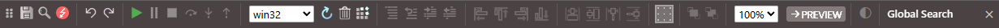

# Toolbar

- Save All Changes (<kbd>CTRL</kbd> + <kbd>S</kbd>)
- Find In Project... (<kbd>CTRL</kbd> + <kbd>SHIFT</kbd> + <kbd>F</kbd>) (<kbd>CTRL</kbd> + <kbd>⇧</kbd> + <kbd>F</kbd>)
- Switch Between Form And Code
- Undo
- Redo
- Start / Continue (<kbd>F5</kbd>)
- Break Into Code (<kbd>CTRL</kbd> + <kbd>BREAK</kbd>)
- Stop
- Step Over (<kbd>SHIFT</kbd> + <kbd>F8</kbd> / <kbd>F10</kbd>)
- Step Into (<kbd>F8</kbd> / <kbd>F11</kbd>)
- Step Out (<kbd>CTRL</kbd> + <kbd>SHIFT</kbd> + <kbd>F8</kbd> / <kbd>SHIFT</kbd> + <kbd>F11</kbd>)
- [Choose a build configuration](#build-configuration)
- Restart the compiler
- Clean (Deregister & delete build)
- Build
- Comment Selection (<kbd>CTRL</kbd> + <kbd>K</kbd>)
- Uncomment Selection (<kbd>CTRL</kbd> + <kbd>SHIFT</kbd> + <kbd>K</kbd>)
- Indent Block (<kbd>CTRL</kbd> + <kbd>[</kbd>)
- Outdent Block (<kbd>CTRL</kbd> + <kbd>]</kbd>)
- Align controls to the LEFT (<kbd>ALT</kbd> + <kbd>ARROWLEFT</kbd>)
- Align controls to the TOP (<kbd>ALT</kbd> + <kbd>ARROWUP</kbd>)
- Align controls to the RIGHT (<kbd>ALT</kbd> + <kbd>ARROWRIGHT</kbd>)
- Align controls to the DOWN (<kbd>ALT</kbd> + <kbd>ARROWDOWN</kbd>)
- Resize controls to the WIDEST (<kbd>CTRL</kbd> + <kbd>SHIFT</kbd> + <kbd>ARROWRIGHT</kbd>)
- Resize controls to the TALLEST (<kbd>CTRL</kbd> + <kbd>SHIFT</kbd> + <kbd>ARROWDOWN</kbd>)
- Resize controls to the NARROWEST (<kbd>CTRL</kbd> + <kbd>SHIFT</kbd> + <kbd>ARROWLEFT</kbd>)
- Resize controls to the SHORTEST (<kbd>CTRL</kbd> + <kbd>SHIFT</kbd> + <kbd>ARROWUP</kbd>)
- Toggle the grid indicators ON/OFF
- Bring the selected control to the FRONT of the z-order
- Send the selected control to the BACK of the z-order
- Form designer zoom ratio
- Launch the form in isolation to test the functionality
- Change IDE Theme
- Global Search

## Build configuration

The build configuration box chooses whether the project is compiled as 32-bit or 64-bit code:

- **win32** builds a 32-bit executable or DLL.
- **win64** builds a 64-bit one. [64-bit Office](../../../Features/Project-Configuration/Project-Types#calling-a-standard-dll-from-vba-or-excel), for example, can load only a 64-bit DLL.

<kbd>CTRL</kbd> + <kbd>F1</kbd> switches to **win64**, and <kbd>CTRL</kbd> + <kbd>F2</kbd> switches to **win32**. The keys are the default bindings of the IDE commands `tbBuild_SwitchToWin64` and `tbBuild_SwitchToWin32`, and [Manage Keyboard Shortcuts](Menu/Window#manage-keyboard-shortcuts) can change them.

The IDE remembers the choice for each project, and sets the box back to it when the project is opened again. It keeps the choice in its own settings, under the path of the `.twinproj` file, not in the project. A project with no remembered choice uses whatever the box shows, and a newly started IDE shows **win32**.

The box also sets the `Win64` compiler constant --- 1 in **win64**, 0 in **win32** --- and so decides which branch of an `#If Win64` block the editor treats as active and which it greys out. [Compiler Constants](../../../Reference/Compiler-Constants#appearance) shows the same code in both modes.

The default [Build Output Path](Settings#build-output-path) puts `win32` or `win64` in the file name, so the two builds do not overwrite each other.

The box has a third entry, **safeMode**. It opens the project's files without starting the compiler services, and the IDE describes it as a way to investigate, fix or recover code before saving it and restarting in normal mode. The IDE also switches to **safeMode** by itself when the compiler keeps crashing, and says *Compiler crash loop detected. Restarting in SAFE mode.*
