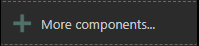
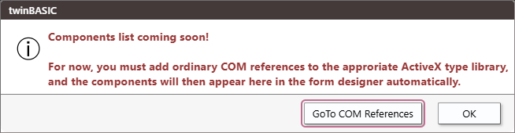
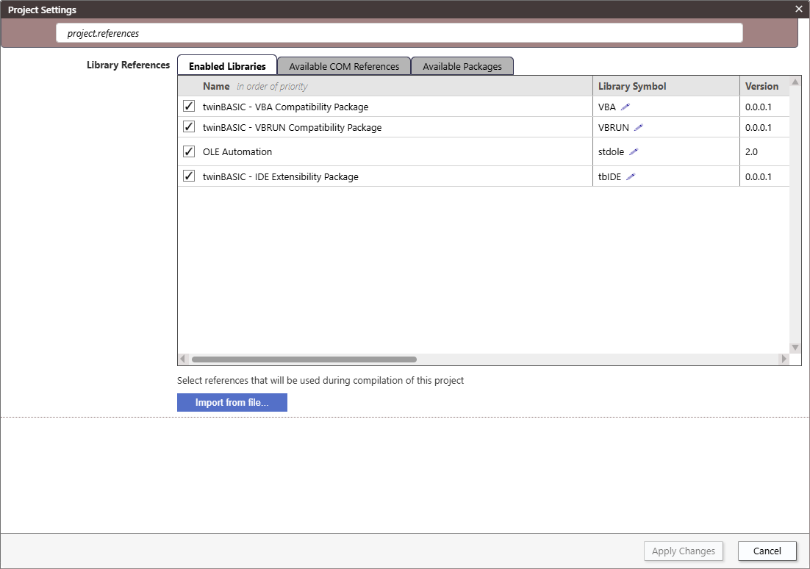
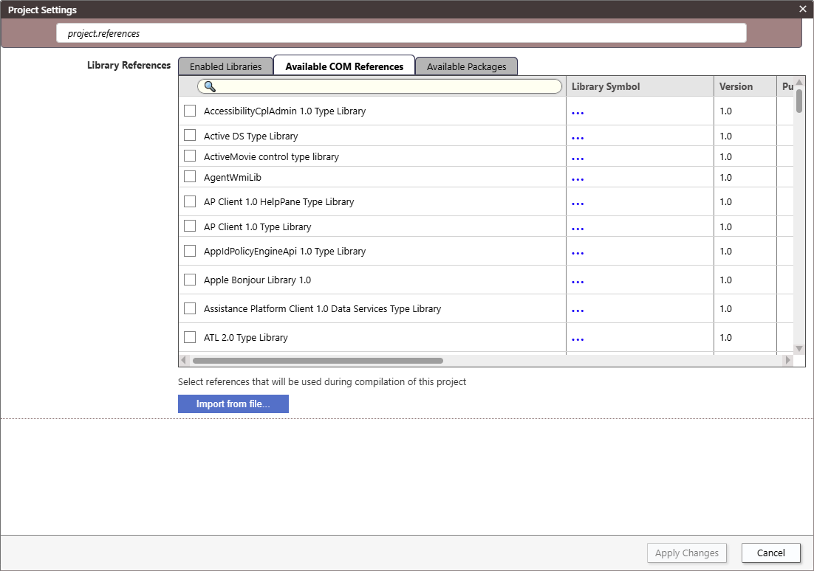

# Toolbox

See [Controls](../../Controls)

<!--  -->

The "GoTo COM References" button takes you to **Project Settings** and filters by "project.references".

Click on the _Available COM References_ tab.

See [Project Settings](Settings) for more info.
