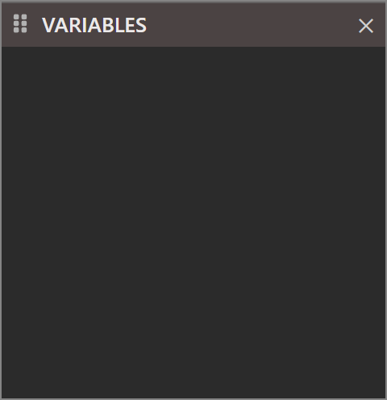

# Variables

{:width="240" height="248"}

The Variables pane lists the variables in scope at the current execution point during debugging, showing each variable's name, type, and current value. Structured types---classes and user-defined types---can be expanded to inspect their individual members. It takes the place of the Locals window in VB6.

The pane lists nothing outside a paused debugging session, which is the state shown above.
