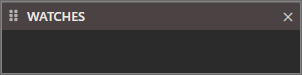
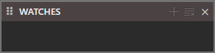
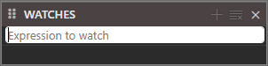

# Watches

When a project isn't open this will be empty.

Once you open a project it will other buttons available.

If you wish to add a new watch click  and type in your "Expression to watch"

You can remove any with the Clear button 
