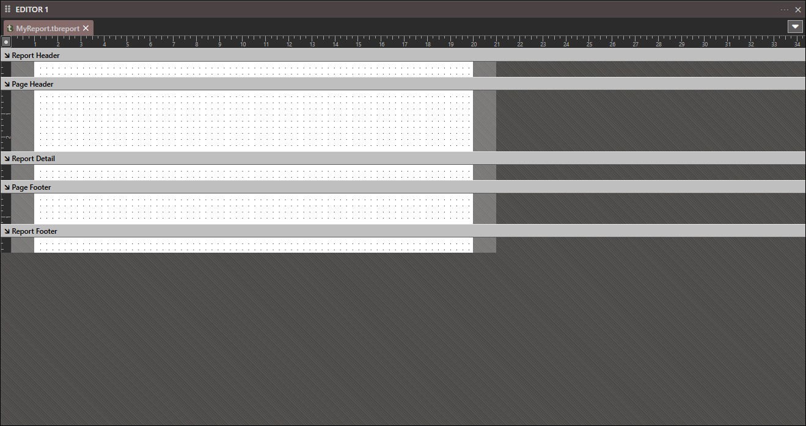

# .tbReport

Contains

- Report Header
- Page Header
- Report Detail
- Page Footer
- Report Footer

Only certain [Controls](../../../Controls) are available to a Report.

- Pointer
- Label
- Shape
- Line
- Image
- CheckMark
- QRCode

