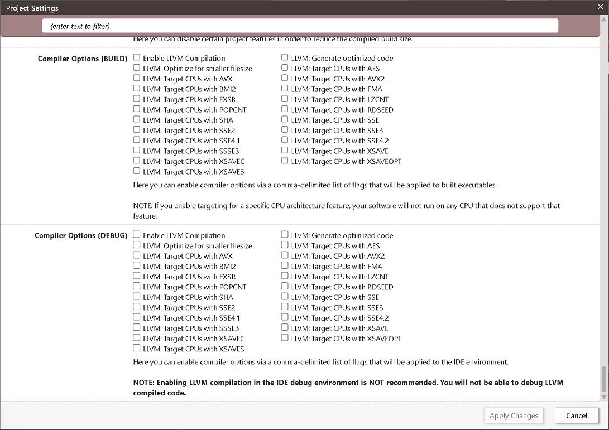
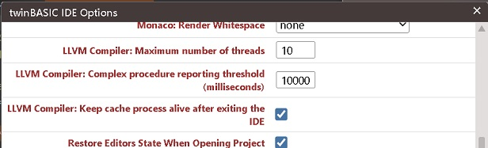

## Getting started with LLVM

### What is LLVM?

LLVM is a feature of the compiler process that allows for creating code highly optimized for performance and size. Most applications will benefit from this, with the degree of improvement depending on the specifics of your code. This works by creating an intermediate representation of your code (a form in between the original twinBASIC language and the final form of machine code) during the compilation process and then reorganizing it using a wide variety of techniques, such as dead code elimination, simplifying loops, modifying mathematical operations to avoid slow operations like division, inlining functions, and many more. It also allows your code, if applicable, to take advantage of specific CPU features designed to accelerate certain operations. 

### LLVM in twinBASIC

LLVM is an optional feature you can enable through Project Settings. It is off by default while still in the experimental stage. In Project Settings, you'll see the following options:

 

The two separate sections control whether LLVM is enabled when compiling your project to .exe, .dll, etc., under "(BUILD)", and when you're running from the IDE, under "(DEBUG)". The first option is for whether LLVM is enabled at all. With this box checked, LLVM will run during the compilation process and create an intermediate representation of your code, but not apply the optimizations for performance and size. Generally, you'll want to check one or both of the next options: Generate optimized code and Optimize for smaller filesize. The remaining options are for special CPU features that are not present on all CPUs. If you enable an option that is not available on the CPU your program runs on, it will crash or not run at all. The options range from features that would almost certainly be available on any CPU from the last 25 years, to features found only on more recent CPUs. An overview of this is included later in this article.

Once the main LLVM options have been enabled, you'll see a 'waiting for LLVM compilation' message when you build or run your program. Compiling with LLVM can take significantly longer than the standard process for larger applications and for applications with particularly large individual methods. It is not unusual for very large applications to take several minutes or longer, depending on your hardware, to compile. twinBASIC employs a cache system so that, in general, subsequent builds will be much faster, with unchanged code sections not needing to be compiled again. The option to clear this cache and perform a full compile next time is available under the Tools menu: 'Flush the LLVM compiler cache'. 

### Availability

Compiling with LLVM is not available with the free Community Edition licence for twinBASIC, so any settings for it will be ignored. For Personal license holders, LLVM can only be used to compile the built-in packages. All other paid licence tiers can take full advantage of LLVM.

### Current limitations

*OS Support*

LLVM is currently not working on Windows 7; Windows 10 or 11 is recommended. Windows 8 and 8.1 have not yet been tested.

*Language support*

The main unsupported feature in the initial release of LLVM support is error propagation up through parent procedures. If any error occurs in a procedure without an error handler, the error will not be picked up by its caller, instead it will cause a crash from an unhandled error. This will be addressed soon.

All language features besides that should be supported, for both 32-bit and 64-bit targets. Please report any LLVM-triggered crashes or if you receive a message saying "a feature used in your code is not yet supported with the LLVM compiler".

### General LLVM options

In addition to the per-project settings, IDE Options has three new settings that control how LLVM is used when it's enabled:

 

The first option is for Maximum number of threads the LLVM compiler can create. Increasing this value can speed up the LLVM compilation process, but will also increase memory usage. If you begin experiencing crashes during LLVM compilation, this value has likely been set too high, and reducing it should fix the crashes. The default value is 1, but newer systems would likely handle 10 or more without issue.\
The 'Complex procedure reporting threshold' is related to the earlier mention of very large procedures taking a long time to compile. This option sets a time threshold; any procedure that takes at least that long to compile will be listed in the Debug Console. This helps you identify which procedures you may want to split up to reduce compile time.\
Finally, the 'Keep cache process alive after exiting the IDE' option is provided so LLVM doesn't need to perform a lengthy full compile again, even if you exit the twinBASIC IDE.

### Per-procedure LLVM options

Whether to reduce compile time or to work around edge cases where LLVM reports problems with a procedure, you can use the `[CompilerOptions("")]` attribute to disable LLVM for individual procedures while keeping it on for the rest of your code. 

Example:

```vb6
[CompilerOptions("")]
Public Sub DoNotOptimizeMe()
...
End Sub
```

The same attribute can also be used to selectively enable LLVM for certain procedures. If you've unchecked the options to enable LLVM in Project Settings, you can still turn it on per procedure by using +llvm, +optimize, +optimizesize, followed by + and the name of each CPU instruction set you wish to enable. These flags are direct equivalents of the options in Project Settings.

+llvm - Enable LLVM Compilation\
+optimize - LLVM: Generate optimized code\
+optimizesize - LLVM: Optimize for smaller filesize

Then there are further options matching CPU feature sets: +aes, +avx, +avx2, +bmi2, +fma, +fxsr, +rdseed, +sha, +sse, +sse2, +sse3, +sse4.1, +sse4.2, +ssse3

Examples:

```vb6
[CompilerOptions("+llvm,+optimize,+optimizesize")]
Function Multiply(A As Long, B As Long) As Long
    Return A * B
End Function

[CompilerOptions("+llvm,+optimize,+optimizesize,+aes,+avx,+avx2,+bmi2,+fma,+fxsr,+rdseed,+sha,+sse,+sse2,+sse3,+sse4.1,+sse4.2,+ssse3")]
Sub FullyOptimizeMe()
...
End Sub
```

### CPU Features details

This section provides an overview of CPU feature availability. It includes the first CPUs to offer it, then the year from which all new Intel and AMD CPUs shipped with the feature. The last column is an estimate; some rare models, such as specialized CPUs for embedded use, may still have lacked support.

```
Feature       First Available (Intel)     First Available (AMD)     Available in all

AES:          2010 (Westmere)             2011 (Bulldozer)          2016

AVX:          2011 (Sandy Bridge)         2011 (Bulldozer)          2022

AVX2:         2013 (Haswell)              2015 (Excavator)          2022

BMI2:         2013 (Haswell)              2015 (Excavator)          2022

FMA:          2013 (Haswell)              2012 (Piledriver)         2022

FXSR:         1997 (Pentium II)           1999 (Athlon)             2011; All x64 CPUs¹

LZCNT:        2013 (Haswell)              2007 (K10/Phenom)         2022

POPCNT:       2008 (Nehalem)              2007 (K10/Phenom)         2013

RDSEED:       2014 (Broadwell)            2017 (Zen)                2020

SHA:          2016 (Atom)                 2017 (Zen)                2022

SSE:          1999 (Pentium III)          2001 (Athlon XP)          2002; All x64 CPUs¹

SSE2:         2000 (Pentium 4)            2003 (Athlon 64)          2005; All x64 CPUs¹

SSE3:         2004 (Pentium 4 Prescott)   2005 (Athlon 64 Rev. E)   2006

SSE4.1:       2008 (Nehalem)              2011 (Bulldozer)          2013

SSE4.2:       2008 (Nehalem)              2011 (Bulldozer)          2013

SSSE3:        2006 (Core 2)               2011 (Bobcat)             2013

XSAVE:        2009 (Penryn E0/R0)         2011 (Bulldozer)          2016

XSAVEC:       2015 (Skylake)              2017 (Zen)                2020

XSAVEOPT:     2011 (Sandy Bridge)         2017 (Zen)                2017

XSAVES:       2015 (Skylake)              2017 (Zen)                2020
```

¹ - Features marked 'All x64 CPUs' are always used in 64-bit builds when optimization is enabled, because they're part of the base feature set all x64 CPUs must support.

### Future of LLVM support in twinBASIC.

This is just the start of LLVM integration in twinBASIC. It lays a strong foundation for us to make much more use of the optimizations and features LLVM can provide. Going forward, we will be restructuring some of the inner workings of the tB compiler to make the best use of these benefits and improve the performance of your code. Stay tuned-- there’s still a lot more to come!