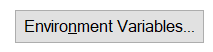
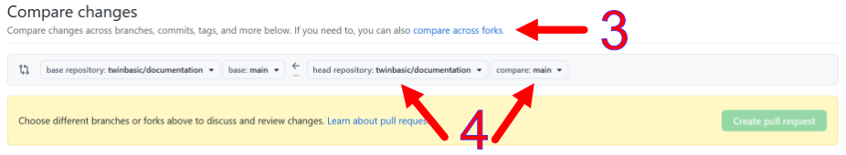
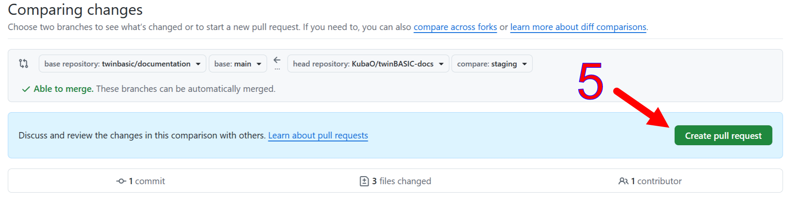
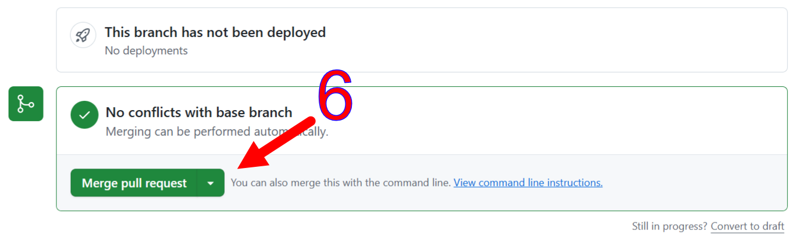
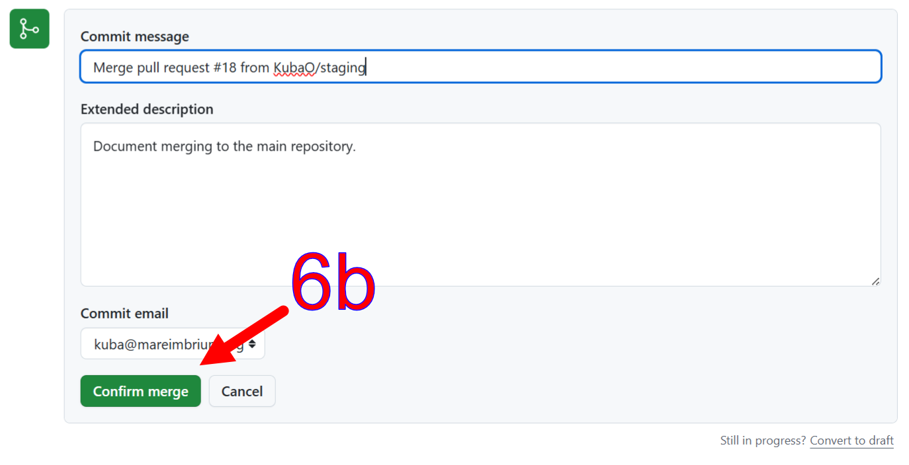
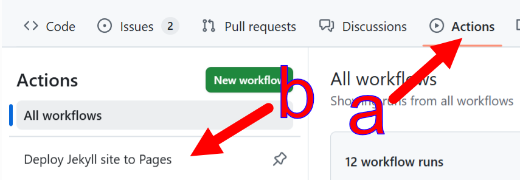
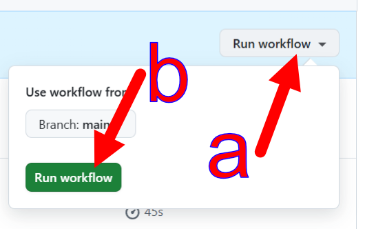

# Documentation Development  
{: .no_toc }

This chapter covers the consumption of the documentation, e.g. in an IDE, as well as the development process of the content itself.

* TOC goes here
{:toc}
## Permanent Links

The stable, or machine-accessible part of the documentation tree is rooted on the `/tB/` prefix. The URLs with this prefix, as well as the internal links (e.g. [`docs.twinbasic.com/tB/Modules/Math#round`](../tB/Modules/Math#round)), are stable.

### /tB/Core/\<Statement\>

- [AppActivate](../tB/Core/AppActivate)
- [Beep](../tB/Core/Beep)
- [Call](../tB/Core/Call), [ChDir](../tB/Core/ChDir), [ChDrive](../tB/Core/ChDrive), [Class](../tB/Core/Class), [Close](../tB/Core/Close), [CoClass](../tB/Core/CoClass), [Const](../tB/Core/Const), [Continue](../tB/Core/Continue)
- [Date](../tB/Core/Date), [Declare](../tB/Core/Declare), [Deftype](../tB/Core/Deftype), [DeleteSetting](../tB/Core/DeleteSetting), [Dim](../tB/Core/Dim), [Do-Loop](../tB/Core/Do-Loop)
- [End](../tB/Core/End), [Enum](../tB/Core/Enum), [Erase](../tB/Core/Erase), [Error](../tB/Core/Error), [Event](../tB/Core/Event), [Exit](../tB/Core/Exit)
- [FileCopy](../tB/Core/FileCopy), [For-Next](/tB/Core/For-Next), [Function](../tB/Core/Function)
- [Get](../tB/Core/Get), [GetSetting](../tB/Core/GetSetting), [GoSub-Return](../tB/Core/GoSub-Return), [GoTo](../tB/Core/GoTo)
- [If-Then-Else](../tB/Core/If-Then-Else), [Implements](../tB/Core/Implements), [Input](../tB/Core/Input), [Interface](../tB/Core/Interface), [Is](../tB/Core/Is)
- [Kill](../tB/Core/Kill)
- [LBound](../tB/Core/LBound), [Let](../tB/Core/Let), [Line-Input](../tB/Core/Line-Input), [Load](../tB/Core/Load), [Lock](../tB/Core/Lock), [LSet](../tB/Core/LSet)
- [Mid-equals](../tB/Core/Mid-equals) for `Mid(...) = ...` , [MidB-equals](../tB/Core/MidB-equals) for `MidB(...) = ...`, [MkDir](../tB/Core/MkDir), [Module](../tB/Core/Module)
- [Name](../tB/Core/Name), [New](../tB/Core/New)
- [Option](../tB/Core/Option), [On-Error](../tB/Core/On-Error), [On-GoSub](../tB/Core/On-GoSub), [On-GoTo](../tB/Core/On-GoTo), [Open](../tB/Core/Open)
- [ParamArray](../tB/Core/ParamArray), [Print](../tB/Core/Print), [Private](../tB/Core/Private), [Property](../tB/Core/Property), [Public](../tB/Core/Public), [Put](../tB/Core/Put)
- [RaiseEvent](../tB/Core/RaiseEvent), [ReDim](../tB/Core/ReDim), [Reset](../tB/Core/Reset), [Resume](../tB/Core/Resume), [RmDir](../tB/Core/RmDir), [RSet](../tB/Core/RSet)
- [SavePicture](../tB/Core/SavePicture), [SaveSetting](../tB/Core/SaveSetting), [Seek](../tB/Core/Seek), [Select-Case](../tB/Core/Select-Case), [SendKeys](../tB/Core/SendKeys), [Set](../tB/Core/Set), [SetAttr](../tB/Core/SetAttr), [Static](../tB/Core/Static), [Sub](../tB/Core/Sub), [Stop](../tB/Core/Stop)
- [Time](../tB/Core/Time), [Type](../tB/Core/Type)
- [Unload](../tB/Core/Unload), [Unlock](../tB/Core/Unlock)
- [While-Wend](../tB/Core/While-Wend), [Width](../tB/Core/Width), [With](../tB/Core/With), [Write](../tB/Core/Write)

### /tB/Modules/\<ModuleName\>

These are modules within VBA and VBRUN:

- VBA
  - [Collection](../tB/Modules/Collection)
  - [Compilation](../tB/Modules/Compilation)
  - [Constants](../tB/Modules/Constants)
  - [Conversion](../tB/Modules/Conversion)
  - [DateTime](../tB/Modules/DateTime)
  - [ErrObject](../tB/Modules/ErrObject)
  - [ExpressionService](../tB/Modules/ExpressionService)
  - [FileSystem](../tB/Modules/FileSystem)
  - [Financial](../tB/Modules/Financial)
  - [Information](../tB/Modules/Information)
  - [Interaction](../tB/Modules/Interaction)
  - [Math](../tB/Modules/Math)
  - [Strings](../tB/Modules/Strings)
  - [TextEncodingConstants](../tB/Modules/TextEncodingConstants)
  - Internal [_HiddenModule](../tB/Modules/_HiddenModule)
- VBRUN
  - [AmbientProperties](../tB/Modules/AmbientProperties)
  - [AsyncProperty](../tB/Modules/AsyncProperty)
  - [Constants](../tB/Modules/Constants)
  - [ContainedControls](../tB/Modules/ContainedControls)
  - [DataMembers](../tB/Modules/DataMembers)
  - [DataObject](../tB/Modules/DataObject)
  - [ErrorCallstack](../tB/Modules/ErrorCallstack)
  - [ErrorContext](../tB/Modules/ErrorContext)
  - [ErrorStackFrame](../tB/Modules/ErrorStackFrame)
  - [Hyperlink](../tB/Modules/Hyperlink)
  - [ParentControls](../tB/Modules/ParentControls)
  - [PropertyBag](../tB/Modules/PropertyBag)

### /tB/Core/Attributes#\<attribute\>

> [!NOTE]
>
> All non-alphabetic characters, as well as parameters, are removed from the links. All attribute names are in lowercase in the links. E.g. `ArrayBoundsChecks(Bool)` is referenced as `/tB/Core/Attributes#arrayboundschecks`. 

- [AppObject](../tB/Core/Attributes#appobject)
- [ArrayBoundsChecks](../tB/Core/Attributes#arrayboundschecks)
- [BindOnlyIfNoArguments](../tB/Core/Attributes#bindonlyifnoarguments)
- [BindOnlyIfStringSuffix](../tB/Core/Attributes#bindonlyifstringsuffix)
- [ClassId](../tB/Core/Attributes#classid)
- [CoClassCustomConstructor](../tB/Core/Attributes#coclasscustomconstructor)
- [CoClassId](../tB/Core/Attributes#coclassid)
- [COMControl](../tB/Core/Attributes#comcontrol)
- [COMCreatable](../tB/Core/Attributes#comcreatable)
- [COMExtensible](../tB/Core/Attributes#comextensible)
- [ComImport](../tB/Core/Attributes#comimport)
- [CompileIf](../tB/Core/Attributes#compileif)
- [CompilerOptions](../tB/Core/Attributes#compileroptions)
- [ConstantFoldable](../tB/Core/Attributes#constantfoldable)
- [ConstantFoldableNumericsOnly](../tB/Core/Attributes#constantfoldablenumericsonly)
- [Debuggable](../tB/Core/Attributes#debuggable)
- [DebugOnly](../tB/Core/Attributes#debugonly)
- [Description](../tB/Core/Attributes#description)
- [DispId](../tB/Core/Attributes#dispid)
- [DllExport](../tB/Core/Attributes#dllexport)
- [DLLStackCheck](../tB/Core/Attributes#dllstackcheck)
- [EnforceErrors](../tB/Core/Attributes#enforceerrors)
- [EnforceWarnings](../tB/Core/Attributes#enforcewarnings)
- [EnumId](../tB/Core/Attributes#enumid)
- [EventInterfaceId](../tB/Core/Attributes#eventinterfaceid)
- [EventsUseDispInterface](../tB/Core/Attributes#eventsusedispinterface)
- [Flags](../tB/Core/Attributes#flags)
- [FloatingPointErrorChecks](../tB/Core/Attributes#floatingpointerrorchecks)
- [FormDesignerId](../tB/Core/Attributes#formdesignerid)
- [Hidden](../tB/Core/Attributes#hidden)
- [IdeButton](../tB/Core/Attributes#idebutton)
- [IntegerOverflowChecks](../tB/Core/Attributes#integeroverflowchecks)
- [InterfaceId](../tB/Core/Attributes#interfaceid)
- [MustBeQualified](../tB/Core/Attributes#mustbequalified)
- [OleAutomation](../tB/Core/Attributes#oleautomation)
- [PackingAlignment](../tB/Core/Attributes#packingalignment)
- [PopulateFrom](../tB/Core/Attributes#populatefrom)
- [PredeclaredID](../tB/Core/Attributes#predeclaredid)
- [PreserveSig](../tB/Core/Attributes#preservesig)
- [Restricted](../tB/Core/Attributes#restricted)
- [RunAfterBuild](../tB/Core/Attributes#runafterbuild)
- [Serialize](../tB/Core/Attributes#serialize)
- [SetDllDirectory](../tB/Core/Attributes#setdlldirectory)
- [SimplerByVals](../tB/Core/Attributes#simplerbyvals)
- [TestCase](../tB/Core/Attributes#testcase)
- [TestFixture](../tB/Core/Attributes#testfixture)
- [TypeHint](../tB/Core/Attributes#typehint)
- [Unimplemented](../tB/Core/Attributes#unimplemented)
- [UseGetLastError](../tB/Core/Attributes#usegetlasterror)
- [UserDefinedTypeIsAnAlias](../tB/Core/Attributes#userdefinedtypeisanalias)
- [WindowsControl](../tB/Core/Attributes#windowscontrol)

## Development Environment

The documentation is built (renderd to html) using [Jekyll][jekyllrb].

1. Ensure that Jekyll and Ruby are installed.

   - [Installing Jekyll via RubyInstaller on Windows](https://jekyllrb.com/docs/installation/windows/#installation-via-rubyinstaller)

   Also ensure that Jekyll is in the PATH. To adjust the path on Windows, press <kbd>⊞ R</kbd>, type `SystemPropertiesAdvanced ` <kbd> Enter</kbd>, and click the **Environment Variables...** button. 

2. Fork [https://github.com/twinbasic/documentation][docs-repo] to your own GitHub account if you plan on making any changes or for convenience. This can be skipped if you just want to build the documentation without changes.

3. Clone either your fork in #2, or the [documentation repository itself][docs-repo].

4. **Go to the `/docs` folder in the cloned working tree.** Building, serving, and other documentation operations are all done in this folder, *not* in the repository root.

### Building

To build the documentation, i.e. render it from `.md` files to the `_site` folder:

    bundle exec jekyll build

or, on Windows only:

    build.bat

### Checking Link Integrity

Before checking link integrity, the documentation must be built. This can be done by ad-hoc by [building](#building),  or continuously in the background by [building and serving](#building-and-local-serving).

To check that none of the internal links in the most recent documentation build are broken:

    bundle exec htmlproofer ./_site --disable-external --no-enforce-https

or, on Windows only

    check.bat

### Building and Local Serving

To build and serve the documentation from http://localhost:4000:

    bundle exec jekyll serve

or, on Windows only:

    serve.bat

The documentation server detects changes in the filesystem and automatically regenerates the html files as needed. The server does *not* follow changes in `_config.yml`. If you change the configuration, the server has to be restarted. Interrupt the server by pressing <kbd>Ctrl</kbd><kbd>C</kbd> repeatedly.

## Deploying to docs.twinbasic.com

1. Push your changes to your Github fork of the [documentation repository][docs-repo].

2. [Open a new pull request in the documentation repository][docs-pr].

3. Click **compare across forks**.

4. Select your repository and branch to merge from.

   

5. Create the pull request.

   

   A maintainer will merge the pull request into the documentation repository. You may wish to mention an outstanding request on [#docs][hash-docs] channel, although the [#github-docs][hash-github-docs] channel provides automated notifications of pull requests. Normally, a maintainer will get a notification of a new pull request via Discord, and will merge it or comment with a request for changes/improvements.

   **The steps below are done by maintainers**

6. Review, then merge the pull request or comment with required changes.

   

   

7. Select the **Deploy Jekyll site to Pages** action.
   {:width="75%"}

8. Manually run the build and deployment workflow, as it doesn't start automatically.
   {:width="50%"}

   

## Editing Screenshots

One way of editing screenshots is to use an integrated vector/pixel software like [Affinity][af]1. A possible workflow is:

1. <kbd>PrtSc</kbd> to capture the screenshot.

2. In Affinity, <kbd>Ctrl-Alt-Shift-N</kbd> (File, New from Clipboard) to get the entire screenshot into the program.

3. Use the Vector Crop tool (from the Vector studio) to crop the screenshot down to the relevant part.

    

4. Select the cropped image, and copy <kbd>Ctrl-C</kbd> to clipboard.

5. Create a new file from clipboard again to open a document with just the cropped screenshot in it  <kbd>Ctrl-Alt-Shift-N</kbd> (File, New from Clipboard).

6. Close the file you opened in #2.

7. Add arrow and labels as needed. Those can be copy-pasted from other `.af` files in this repository.

8. Export to PNG <kbd>Ctrl-Alt-Shift-W</kbd> (File, Export, Export...).

>  [!NOTE]
> It is a convention to put the `.af` ("source") files in the `_Images` folder, and the exported `.png` files in the `Images` folder. Only the latter is published to the website. The former is only to preserve sources for easy editing/updates.

---

1 Affinity is a free-as-in-beer software that combines the functionality of a vector editor, a bitmap editor, and a publishing layout editor. To download, a Canva account is required. The accounts are free.

[af]: https://www.affinity.studio/download

[docs-pr]: https://github.com/twinbasic/documentation/compare
[docs-repo]: https://github.com/twinbasic/documentation
[hash-docs]: https://discord.com/channels/927638153546829845/1021635324809596988
[hash-github-docs]: https://discord.com/channels/927638153546829845/1111554338221989908
[jekyllrb]: https://jekyllrb.com/

