# twinBASIC Frequently Asked Questions

### [General](#general) - [Installation](#installation) - [Using twinBASIC](#using-twinbasic)

## General

<b>What is twinBASIC?</b>

twinBASIC is a new BASIC language and development environment (IDE) aiming to be 100% backwards compatible with VB6/VBA. 

<b>Who is behind twinBASIC?</b>

twinBASIC is the work of Wayne Phillips, who operates the company [Everything Access](https://www.everythingaccess.com/), a well established provider of professional tools and services for Microsoft Access and VBA generally, including the popular vbWatchdog software.

<b>Where can I get twinBASIC?</b>

The latest version can be downloaded from the [Releases section](https://github.com/twinbasic/twinbasic/releases) of the [main twinBASIC GitHub repository](https://github.com/twinbasic/twinbasic). See [How do I install twinBASIC](#how-do-i-install-twinbasic) for more information on installation.

<b>What is the current status of the project?</b>

twinBASIC is currently late into the **Beta** stage, under development and not yet at a stable 1.0 release. All of the VB6/VBA7 syntax and intrinsic functions have been implemented. All of the basic controls except the OLE control, and about half of the Common Controls, have been implemented. It supports Forms, Classes, and UserControls-- both as compiled OCX/DLL controls and as in-project code (i.e. like .ctl files). However, not all features of these, such as properties, events, and methods, have been completed. Additionally, ActiveX EXEs and VBG project group support are not yet implemented, and there's a fair number of bugs remaining.

However, **tB can already run many existing projects**, even fairly complex and large ones. Many community members have managed to get their apps and other open source apps up and running with little to no difficulty, and created new projects from scratch. Check out these examples for a good real world demonstrate of how far along the project is:

Krool's [VBCCR](https://github.com/Kr00l/VBCCR) and [VBFlexGrid](https://github.com/Kr00l/VBFLXGRD) controls, Ben Clothier's [TwinBasicSevenZip](https://github.com/bclothier/TwinBasicSevenZip), Carles PV's [Lemmings](https://github.com/fafalone/Lems64), Don Jarrett's [basicNES](https://github.com/fafalone/basicNES) Nintendo emulator, and Jon Johnson's [ucShellBrowse/ucShellTree](https://github.com/fafalone/ShellControls), [FileActivityMon ETW Event Tracer](https://github.com/fafalone/EventTrace), [cTaskDialog](https://github.com/fafalone/cTaskDialog64), and [many more](https://github.com/fafalone).

<b>Is there an estimated timeline for when expected features will become available?</b>

Yes, see the [twinBASIC Roadmap](https://github.com/twinbasic/twinbasic/issues/335) in the Issues section for the latest update to the timeline. This roadmap only covers major components; smaller features are implemented in a less formal manner, usually when the related part of the codebase is being worked on.

<b>What new features does twinBASIC have compared to VB6?</b>

**Many!** It has 64bit compilation (using VBA7x64 compatible syntax), generics, overloading, multithreading (API-only right now, built in syntax coming soon), inheritance, ability to define interfaces and coclasses in your project using BASIC-style syntax, Unicode support in all controls and the editor (.twin files only), support for modern image formats, numerous enhancements to *Implements*, ability to create standard DLLs and kernel mode drivers, ability to set UDT packing alignment, and dozens of others, all available *right now*, with many more planned in the future.

For a full list of all the new features available right now, see the Wiki article [Overview of features new to twinBASIC](twinBASIC-Features).

<b>Where can I learn more about twinBASIC, find documentation, and participate in the community?</b>

[twinBASIC Home Page](https://twinbasic.com)

twinBASIC GitHub: [Main section](https://github.com/twinbasic/twinbasic) \| [Issues](https://github.com/twinbasic/twinbasic/issues) \| [Discussions](https://github.com/twinbasic/twinbasic/discussions) \| [Language Design](https://github.com/twinbasic/lang-design) \| [ Language Specification](https://github.com/twinbasic/lang-spec) \| [Documentation](https://docs.twinbasic.comi)

[twinBASIC Discord](https://discord.gg/UaW9GgKKuE)

[twinBASIC Forum on VBForums](https://www.vbforums.com/forumdisplay.php?108-TwinBASIC)

<a id="is-twinbasic-open-source" />

<b>Is twinBASIC Open Source?</b>

While open source models are possible in the future, at this time the compiler is not. There are plans in the works to open source the IDE. To address some of the major concerns this presents, once tB hits it first major release, the source code will be placed in escrow, to be released to the community in the event the author disappears or is unable to continue working on it due to death or serious illness/injury. 

<b>How much does twinBASIC cost?</b>

There are 3 editions of twinBASIC: The Community Edition is FREE. A splash screen is placed on compiled 64bit binaries and certain features like advanced optimized compilation and future cross-platform compilation are unavailable, but there are no restrictions on core language features or royalties imposed. To get those features, subscriptions are available for the Professional and Ultimate editions. For more details, including current pricing for Professional and Ultimate editions, [see this page](https://twinbasic.com/preorder.html).

Note that you can change the subscription level at any time and the community edition is always available. There will be no lockout (see [the previous statement regarding escrow](#is-twinbasic-open-source)) so you will always have the ability to develop, test and compile. 

<b>Can I pay a one-time fee for a perpetual license?</b>

Due to the need for continuing income to be able to develop twinBASIC, subscriptions are the primary model for premium versions, which [are available](https://twinbasic.com/preorder.html) on a month-to-month or yearly basis. However, right now for a limited time, a buy-once perpetual license is available in the form of the [VIP Gold Lifetime Licence Initiative](https://twinbasic.com/vip.html). This provides not only a lifetime license to twinBASIC including updates and new versions, but numerous additional benefits available only to people who purchase this license. 

<b>Can twinBASIC be used to develop commercial products, and what royalties are owed?</b>

There are no restrictions on any edition of twinBASIC; they can all be used to develop commercial products, on a ROYALTY FREE basis. Nothing is owed for selling programs or other products created with twinBASIC. The twinBASIC software itself, however, may not be redistributed without appropriate license.

<b>What does '100% backwards compatible' mean, technically?</b>

Backwards compatibility refers to matching all publicly documented syntax, included controls, component and control behavior, and control appearance. It does not include undocumented, proprietary internal implementation details. So for example all language keywords, functions, and methods are present and should give the same results, and Forms/Classes/UserControls should implement all the same publicly documented interfaces, but twinBASIC exe files are not internally structured in the same way, and there isn't compatibility with the undocumented VB project info structures in the exe, whose contents have been reverse engineered over the years by the community. 

Currently, all basic controls have reimplementations in twinBASIC that support Unicode and 64bit compilation except the OLE control; and a number of the primary Common Controls have also been reimplemented. Eventually, all controls shipped with VB6 Enterprise Edition will be reimplemented. Until that time, the original controls will still work in 32bit builds, and community members provide some alternatives, for example Krool's VBCCR controls and VBFlexGrid control all work and have 64bit-compatible twinBASIC versions.

<b>So some of my projects won't work?</b>

Most projects do not use these reverse engineered internals, but some do: most commonly, for self-subclassing and callbacks inside Forms/Classes/UserControls; and also for multithreading and inline assembly. These routines have native support in twinBASIC without requiring internals hacks, so replacing these small parts of a few programs is very simple: `AddressOf` is supported on class members, so you can use regular subclassing and callback methods as you would if they were in a .bas module. `CreateThread` can be called without any special steps. And tB supports statically linked .obj files allowing incorporation of code from other languages, inline assembly in the form of `Emit()`/`EmitAny()` to insert instructions, and further support is planned in the future.

Additionally, twinBASIC redirects the most common msvbvm60.dll (also msvbvm50.dll/vbe6.dll/vbe7.dll) functions used as `Declare` statements by users, all of which also work in x64, if you add the `PtrSafe` keyword like any other DLL definition. The following functions currently have redirects: `VarPtr, GetMem1, GetMem2, GetMem4, GetMem8, PutMem1, PutMem2, PutMem4, PutMem8, __vbaObjSet, __vbaObjSetAddRef, __vbaObjAddRef, __vbaCastObj, __vbaCopyBytes, __vbaCopyBytesZero, __vbaRefVarAry`, and `__vbaAryMove`. You may continue to use these with `Declare` statements to support the particular signatures you prefer. Further, declares for olepro32.dll are redirected to identical functions in oleaut32.dll, as olepro32 was deprecated by NT4 and doesn't have a 64bit version.

Other than those special cases, it's exceedingly rare for projects to depend on reverse engineered internals. So the vast majority of projects run with zero modification. 

<a id="how-do-i-report-bugs-or-other-problems" />

<b>How do I report bugs or other problems?</b>

The best way is to [create an issue](https://github.com/twinbasic/twinbasic/issues) in the twinBASIC GitHub repository.

You can also create a post in the #bugs channel of the [twinBASIC Discord server](https://discord.gg/UaW9GgKKuE).

<b>Is the twinBASIC IDE available in other languages?</b>

The IDE currently has basic support for localizing all of the front end UI, with translations supplied by members of the community. These can be obtained from [#langpacks on the tB Discord server](https://discord.com/channels/927638153546829845/1329533568376115282), there's currently around 10 including French, German, Italian, Portuguese, Russian, Chinese (Simplified), Chinese (Traditional), Japanese, Swedish, Hungarian, Greek, Catalan, Indonesian (Bahasa), and Malayalam. Others may have been posted since this was written; check the channel.

Internal text such as the hover information does not yet support localization, but this is planned for the future.

## Installation

<b>What are the requirements for twinBASIC?</b>

The twinBASIC IDE is supported on Windows 7 through Windows 11. The installation is portable; you need only to extract the downloaded zip file then run; there's no installer. 

WebView2 is required. This is normally preinstalled on newer versions of Windows, and is installed along with Edge if you've installed that browser. You can also obtain it from [Microsoft's website](https://developer.microsoft.com/en-us/microsoft-edge/webview2?form=MA13LH#download-section). Select the Standalone Evergreen x86 version:

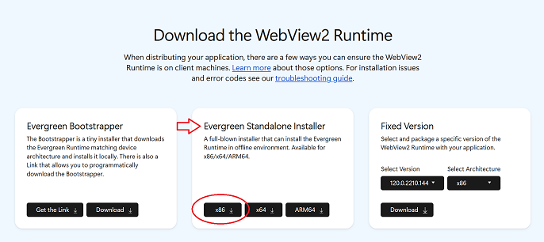

<b>twinBASIC won't run; says there's an invalid entry point.</b>

This issue is sometimes encountered on Windows 7. To be used on Windows 7, the OS must be fully updated; this error results from one or more missing updates. Run Windows Update to make sure you have all recent updates installed. If you still have problems, you can drop by the Discord or submit an issue on GitHub (see [`How do I report bugs or other problems?`](#how-do-i-report-bugs-or-other-problems))

<a id="how-do-i-install-twinbasic" />

<b>How do I install twinBASIC?</b>

tB does not require a full installation process, you need only extract the ZIP file. Download the latest version from the [Releases page](https://github.com/twinbasic/twinbasic/releases), named `twinBASIC_IDE_BETA_xxx.zip` (where xxx is a version number; click on 'Assets' to expand the file list if it's not already visible).

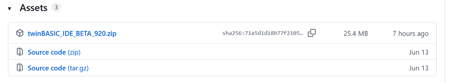

Download the zip and extract it to an **empty** folder. Do not simply overwrite a previous version; either delete everything in the folder or use a different one. Odd errors have been known to occur otherwise.  It will run from this folder; some settings will be placed in AppData. 

<b>How big is the twinBASIC installation?</b>

The IDE is quite small, it's currently only a 25MB download, about 80MB extracted, and that is half due to LLVM libraries.

<b>Where is twinBASIC IDE data stored?</b>

In addition to the directory you extract the IDE to, twinBASIC creates a folder in `%APPDATA%\Local\twinBASIC` and stores some settings in the Registry under `HKCU\Software\VB and VBA Program Settings\twinBASIC_IDE`.

<b>Is twinBASIC safe? (Some scanner) says it's malicious.</b>

Anyone who has ever tested their own programs against a wide variety of AV engines knows that unless your exe is 64bit and signed with a high-level certificate (and maybe not even then, until it's manually added to a trust list), false positives in a small number are simply a way of life. twinBASIC's IDE and compiler executables, like all apps in its position, may trigger a small number of positives on services like VirusTotal, particularly 32bit apps. These are almost always not from major vendors and/or "AI" based algorithmic detection.

## Using twinBASIC

<b>How do I import my VB6 project into twinBASIC?</b>

The easiest way is through the import wizard. When you first start the twinBASIC IDE, you're presented with the New Project dialog- this contains an 'Import from VBP' option:

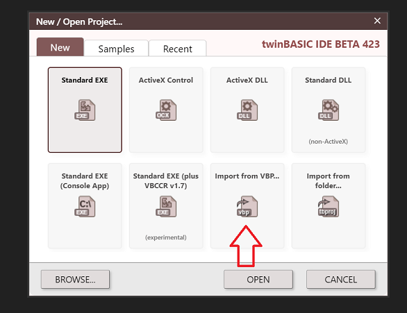

You can import individual files, from VB projects or any type, through the Import option on the Add menu, under Project or by right clicking the desired folder in the Project Explorer pane:

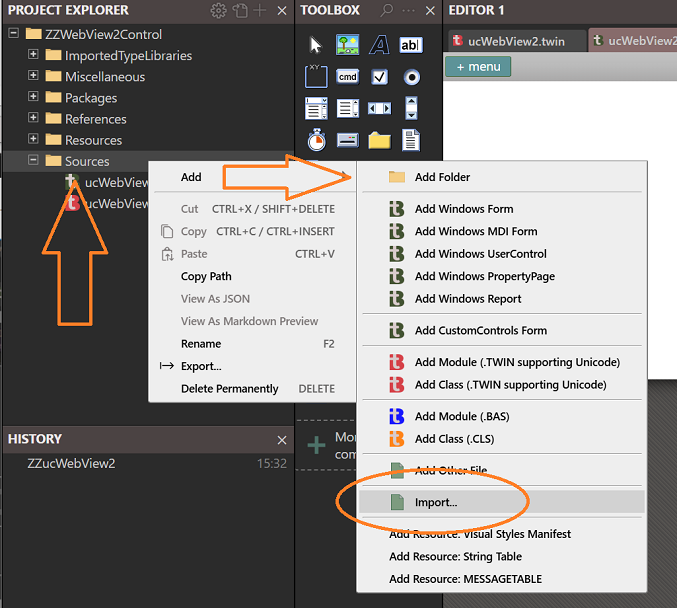{:style="width:80%; height:auto;"}

**NOTE:** You can select .bas/.cls files individually, but to import Forms, UserControls, Property Pages, and Resource Files you must currently select the .vbp file they're associated with. You'll then be shown a list of files you can import (with their new twinBASIC extensions .tbform/.twin etc-- make sure to import both, e.g. for Form1.frm you'll see Form1.frm.tbform and Form1.frm.twin:

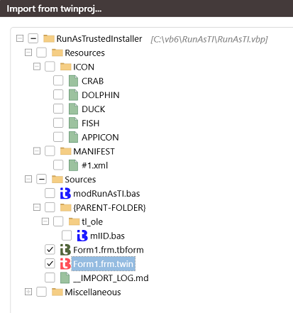{:style="width:50%; height:auto;"}

<b>Why do I see a lot of errors saying my variables are unrecognized?</b>

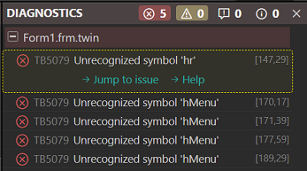

While use is strongly recommended and considered a best practice, twinBASIC **does not** require `Option Explicit`. If you're seeing these errors, you may have overlooked a new feature of twinBASIC: automatically enabling `Option Explicit` project-wide. When you import a VB6 project, or create a new one, a small dialog pops up:

If you leave "Option Explicit ON" checked, that means it will be enforced project-wide, regardless of whether `Option Explicit` is used in the form/module/etc itself. If you uncheck it, you won't get any errors for it, just a warning: "This variable has been auto-declared by the compiler due to Option Explicit being OFF". If you want, you can disable that warning in Project Settings:

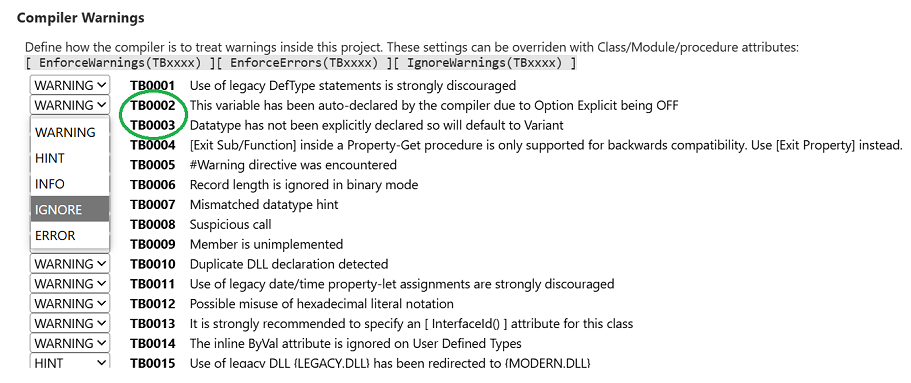

For an existing project, the Project Scope Option Explicit can be turned on or off from Project Settings, under "Project: Option Explicit On":

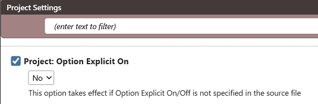

<b>Does twinBASIC support addins?</b>

Addins for VB6 and VBA are not supported by the twinBASIC IDE. However, tB has its own powerful addin infrastructure based on modern web technologies. See Samples 10 through 16 in the 'Samples' tab of the New Project dialog:

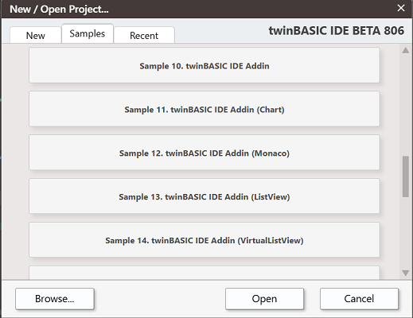 

twinBASIC supports **creating** addins for VBA. It's currently the only tool that supports creating these addins for 64bit Office using a language with 100% compatible syntax. See Sample 4 and Sample 5. 

<b>How do I use resources in twinBASIC?</b>

Currently tB does not have a dedicated resource editor; instead, resources are managed through the Project Explorer. In the tree, you'll see a Resources folder; by default, it will include ICON in a Standard EXE, and MANIFEST, if you've chosen to enable Visual Styles:

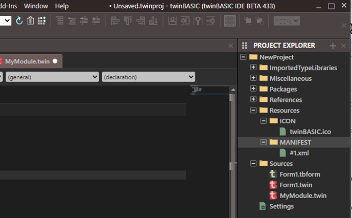

You can create additional folders here, using their standard names. For example a BITMAP group could be added, then used with `LoadResImage`. Unlike its predecessor, tB does not restrict the type of resources: you can create any type of folder you want, and import binary data into it. For example, some community projects have inserted `UIFILE` resources for Ribbon controls and `DIALOG` resources for property sheets. Resources can be imported by right-clicking the folder you want them in, and selecting Add->Import file... from the menu.

If you're importing a project, the resources in a linked .res file will be imported automatically.

#### Strings

String table resources are currently treated specially; they're edited in the IDE as JSON. If you import from VBP with a .res, string resources will be automatically converted. If you right click the 'Resources' folder, and go to the 'Add' submenu, at the bottom, you'll find "Add resource: String table" that adds one populated with example strings:

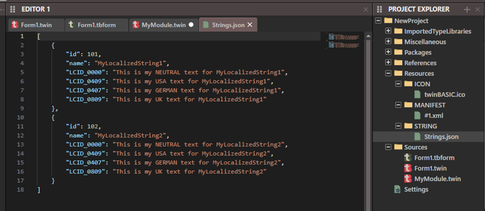

#### Group names

If you create a new folder for a standard resource type, twinBASIC currently recognizes the following names, which you should use to create a folder under Resources:

BITMAP  
CUSTOM  
CURSOR  
ICON  
MANIFEST  
RCDATA  
STRING  
MESSAGETABLE

For other standard types, you must use the # (pound sign) followed their number. For example, for DIALOG (RT_DIALOG) resources, do not name the folder dialog, it must be named `#5`. ANICURSOR would be named `#21`. And so on, for the [standard types](https://learn.microsoft.com/en-us/windows/win32/menurc/resource-types) with `RT_` constants. For any others, you can use any name you want, e.g. UIFILE can just be named UIFILE. 

Note: At this time, .res files can only be imported as part of a VBP.

<b>How do I set my own icon for my program?</b>

By default newly created projects use the twinBASIC logo.  
Imported projects use the icon of the Form chosen in Settings. This can be modified or set for all projects in the same way: in the Settings dialog for your project, there is an "Icon Form" option from which you can select which Form's icon will be used for your exe.

If you don't set that option, or your project contains no Forms, the icon can be managed manually through the Resources folder.  
If you're not already familiar with using resources in twinBASIC, see the FAQ entry right above this one. In this scenario, the icon used for your application in Explorer is the one in the Resources\ICON folder that comes first alphabetically. If you do not have an ICON folder in your project, you can create one by right-clicking the Resources folder and selecting Add->Add folder.

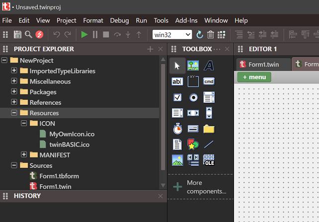

In the above picture, MyOwnIcon.ico would be used by Explorer and other apps to represent your .exe, as it comes before twinBASIC.ico alphabetically. 

Note that this will not be set as the icon of any form; icons for forms are set by the "Icon" property in the Properties list.

You may set both the Icon Form option and include additional ICON resources. In this scenario, the Icon Form will take precedence- it will be inserted as #1, making it the first possible entry and therefore being used by Explorer. Do not use #1 for any of your additional icons in Resources in this scenario, the results may be unpredictable.

 

<b>What are the runtime requirements for twinBASIC-produced EXEs/binaries?</b>

Programs and modules/controls produced by twinBASIC have no native dependencies besides standard Windows system DLLs and are completely standalone/portable, besides of course 3rd party files your code may use. No runtime is required to be present.  
Currently the minimum supported Windows version is **Windows XP**, with Windows 2000 support likely in the future. There are no current plans to support Windows ME, 98, 95, NT4, or earlier versions, as these lack key features for basic modernization provided by tB.  
Certain new tB-exclusive features like child control transparency require newer versions only if they're used.  
Everything should also work under WINE and ReactOS, but testing, while successful, has been minimal. Please share your experiences if you try this.

<b>Why are EXEs produced by twinBASIC larger than VB6?</b>

The large majority of functionality, including major pieces like the Forms engine, is provided in VB6 applications/components by the msvbvm60.dll runtime, a 1.4MB file. twinBASIC applications/components have no such outside dependency; the Forms engine and all other functionality is included in the single exe, so the combined size isn't too far off. EXE size is expected to be reduced significantly with the introduction of LLVM-optimized compilation, coming soon.

 
