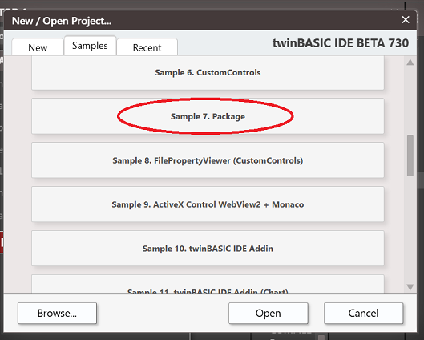
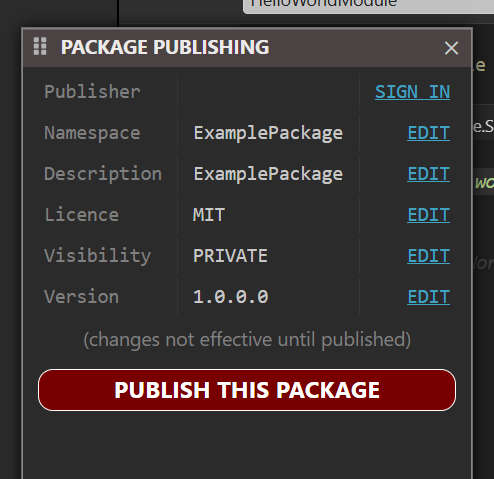
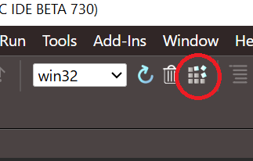
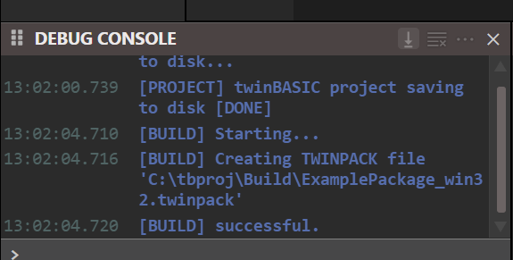
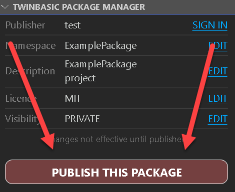
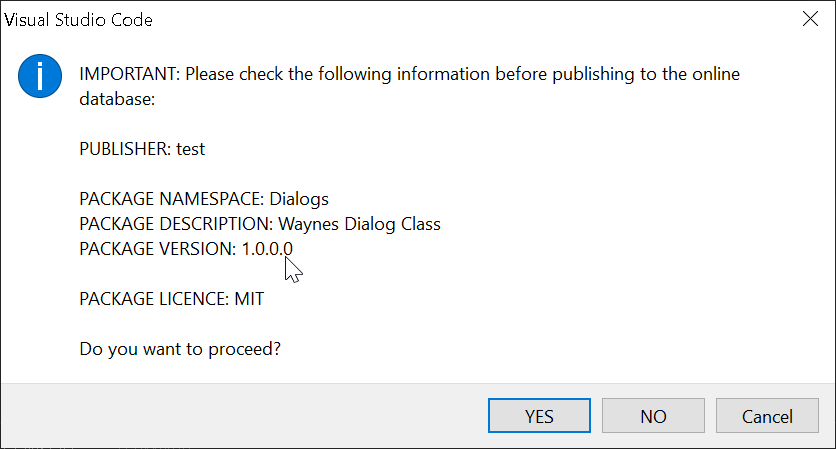
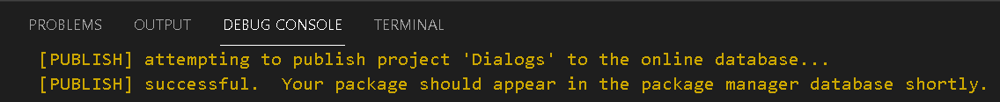
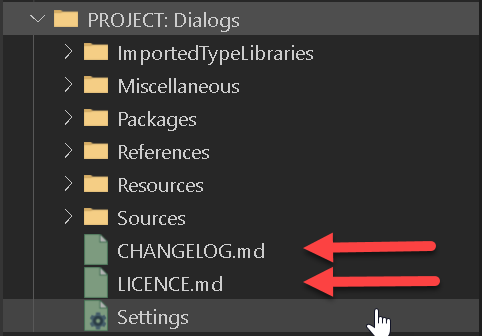

# Creating a TWINPACK package

To create a new TWINPACK package, navigate to the twinBASIC New Project dialog, and under the 'Samples' tab, choose the option labelled 'Package':

 
 

Once you've created the project, you should find the extra 'PACKAGE PUBLISHING' panel as a popup:

 
 

You should now edit the Namespace, Description, Licence and Visibility properties appropriately by using the package manager 'EDIT' links, which will take you to the individual settings in the `Settings` file.   Once you've edited them, remember to close (and save) the `Settings` file in order for your changes to be reflected in the package manager panel.

- **Namespace:** this is the symbol that will be used to group your components in projects that reference your package.  For example, a package that provides a series of different dialog classes might use the namespace `Dialogs`.
- **Description:** this is the descriptive text that will appear in the `Settings`->`References` list.  If you plan to share this package, it is wise to think carefully about the description so that others can find your package easily through TWINSERV.
- **Licence:** this short text appears in the `Settings`->`References` list, alongside the Description.  If you plan to share this package, it is important that you enter this field, and the value you enter here should appropriately match the content of the LICENCE.md file (e.g. 'MIT', 'LGPL' etc).
- **Visibility:** determines whether the package is visible to only you (PRIVATE) or everyone (PUBLIC).  The value set here only takes effect when you use the 'PUBLISH THIS PACKAGE' button to publish your package in the package manager service, TWINSERV.

*If you don't plan to publish your package on TWINSERV, then you don't need to fill in the **Licence** or **Visibility** fields.*

You can now create components (Class, Module, Interface) in your project as normal, and when you are finished, it's time to finalize the package.   You have two options;

 

## OPTION 1 - Finalize the package into a TWINPACK file

Use this option if you want to just create a local TWINPACK file that you can use in other projects.  For this, the build process is the same as any ordinary twinBASIC build... just hit the Build button in the TWINBASIC toolbar:

 
 

You'll see the build output notification in the `DEBUG CONSOLE`, as seen above.

Job done.  See [Importing a package from a TWINPACK file](Importing-TWINPACK) for referencing and using the TWINPACK file in other twinBASIC projects.

 

## OPTION 2 - Publish the package directly to the package manager service (TWINSERV)

If you're publishing your package onto TWINSERV, you don't need to create the TWINPACK file manually.  Just use the 'PUBLISH THIS PACKAGE' button:

{:style="width:45%; height:auto;"}
 
 

***Publishing packages onto TWINSERV requires you to first create a publisher account.  If you haven't done so, you'll be prompted to do so at this stage.***

You will then be prompted to confirm the package details:

{:style="width:65%; height:auto;"}
 
 

After pressing `YES`, the package will be uploaded to TWINSERV.   Check the `DEBUG CONSOLE` for completion notices:

{:style="width:85%; height:auto;"}

 
 

 If the package got uploaded successfully, it should be available via TWINSERV within a few moments.   If you've created a `PUBLIC` package, others will be able to see and download it at this point.

See [Importing a package from TWINSERV](Importing-TWINSERV) for referencing and using the uploaded packages.

 
 

## Special files LICENCE.md and CHANGELOG.md

When you create a new package project, you'll see two additional files created for you in the project filesystem:

{:style="width:55%; height:auto;"}
 
 

If you're publishing a `PUBLIC` package to the package manager service, it is important that you edit these two files before publishing.  These are both markdown files, and will in future become more accessible to users that are considering using your package from TWINSERV. 