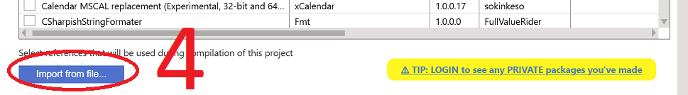
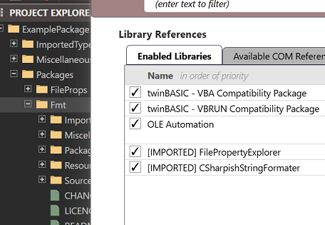
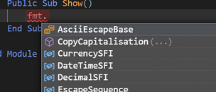

# Importing a package from a TWINPACK file

To import a package directly from a TWINPACK file (instead of using TWINSERV), follow these steps.

- open the project from which you want to use a package
- open the `Settings` file within it
- navigate to the References section
- select the 'Available Packages' button

- press the 'Import from file...' button:

- choose the TWINPACK file you want to import, and then it should appear in the references list (ticked):

 
 

- Save the `Settings` and if needed restart the compiler

Now you're ready to use the package!  In the example shown above I added a reference to the CSharpishStringFormater package, and I can now confirm that I can access components from the package in my code:

 
 