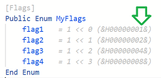

# Attributes
{: .no_toc }

Attributes have two major functions: 

- they can act as instructions to compiler to influence how code is generated, or 
- to annotate Forms, Modules, Classes, Types, Enums, Declares, and [procedures](../Gloss#procedure) i.e. Subs/Functions/Properties. 

Previously in VBx, these attributes, such as the procedure description, hidden, default member, and others, were set via hidden text the IDE's editor didn't show you, configured via the Procedure Attributes dialog or some other places. In tB, these are all visible in the code editor. The legacy ones from VBx are supported for compatibility, but new attributes utilize the following syntax:   
`[Attribute]` or `[Attribute(value)]`

In attributes that take an optional boolean argument, the value of the argument is taken to be **True** if no value is provided. This does not mean that the default value of the attribute is True, just that if the attribute is specified within the braces with no value, its value will be set to True. Different boolean-valued attributes have different default values. Those values apply unless the user has explicitly provided the attribute.

Multiple attributes can be specified in the same square braces, separated by comma:   
`[Attribute1, Attribute2(param), Attribute3]`

---

The available attributes are listed below in alphabetic order. Not every attribute applies to every language element. The applicability of each attribute is given below its syntax.
* TOC
{:toc}
---

## AppObject  (optional Bool)

{: #appobject }

Syntax: **[AppObject** [ **( True** \| **False )** ] **]**

Applicable to: [**CoClass**](CoClass)

Legacy VB attribute: *VB_GlobalNameSpace*

Indicates the class is part of the global namespace. You should not include this attribute without a full understanding of the meaning. The **Global** class is an AppObject.

For more details, see [this VBA documentation page](https://learn.microsoft.com/en-us/openspecs/microsoft_general_purpose_programming_languages/ms-vbal/189fb41b-cc3a-4999-a6d2-ba89f72d2870).

## ArrayBoundsChecks  (optional Bool)

{: #arrayboundschecks }

Syntax: **[ArrayBoundsChecks** [ **( True** \| **False )** ] **]**

Applicable to: [**Class**](Class), [**Module**](Module), [procedure](../Gloss#procedure)

Disables or enables array element access bounds checking within the scope of a class, module, or a single procedure/method. Used on performance-critical routines.

## BindOnlyIfNoArguments  (optional Bool)

{: #bindonlyifnoarguments }

Syntax: **[BindOnlyIfNoArguments** [ **( True** \| **False )** ] **]**

Applicable to: [procedure](../Gloss#procedure)

Only binds this name to a callsite when no arguments are present. Normally false, but see below for an exception.

This attribute resolves the cases where compiler's special treatment of certain procedure names conflicts with a procedure of the same name that shouldn't be treated specially. This currently affects procedures named `Left`. Such procedures get an implicit `[BindOnlyIfNoArguments(True)]` assigned by the compiler. If the user wants to have a procedure of this name, it should include `[BindOnlyIfNoArguments(False)]`.

## BindOnlyIfStringSuffix  (optional Bool)

{: #bindonlyifstringsuffix }

Syntax: **[BindOnlyIfStringSuffix** [ **( True** \| **False )** ] **]**

Applicable to: [procedure](../Gloss#procedure)

## ClassId  (String)

{: #classid }

Syntax: **[ClassId("** 00000000-0000-0000-0000-000000000000 **")]**

Applicable to:  [**Class**](Class)

Assigns a COM CLSID to a class. For details, [see this COM documentation page](https://learn.microsoft.com/en-us/windows/win32/com/com-class-objects-and-clsids).

## CoClassCustomConstructor  (String)

{: #coclasscustomconstructor }

Syntax: **[CoClassCustomConstructor("** fully qualified path to factory method **")]**

Applicable to: [**CoClass**](CoClass)

Allows custom logic for creating and returning a new instance of the coclass' implementation.

Example:

```vb
[CoClassId("7980D953-10BF-478C-93BB-DD0093315D96")]
[CoClassCustomConstructor("FooFactory.CreateFoo")]
[COMCreatable(True)]
Public CoClass Foo
   ' ...
End CoClass
```

For an overview of coclasses in tB, see [Defining coclasses](../../Features/Overview#defining-coclasses).

## CoClassId  (String)

{: #coclassid }

Syntax: **[CoClassId("** 00000000-0000-0000-0000-000000000000 **")]**

Applicable to: [**CoClass**](CoClass)

In addition to interfaces, twinBASIC also allows defining coclasses -- creatable classes that implement one or more defined interfaces. Like interfaces, these too must be in .twin files and not legacy .bas/.cls files, and must appear prior to the `Class` or `Module` statement. The generic form is:

```vb
[CoClassId("00000000-0000-0000-0000-000000000000")]
*<attributes>*
CoClass <name>
    [Default] Interface <interface name>
    *[Default, Source] Interface <event interface name>*
    *<additional Interface items>*
End CoClass
```

The methods are [procedures](../Gloss#procedure).

For an overview of coclasses in tB, see [Defining coclasses](../../Features/Overview#defining-coclasses).

## COMControl  (optional Bool)

{: #comcontrol }

Syntax: **[COMControl** [ **( True** \| **False )** ] **]**

Applicable to: [**Interface**](Interface)

## COMCreatable  (optional Bool)

{: #comcreatable }

Syntax: **[COMCreatable** [ **( True** \| **False )** ] **]**

Applicable to:  [**CoClass**](CoClass)

Indicates that this coclass can be created with the [**New**](New) keyword.

## COMExtensible  (optional Bool)

{: #comextensible }

Syntax: **[COMExtensible** [ **( True** \| **False )** ] **]**

Applicable to: [**Interface**](Interface), [procedure in an Interface](../Gloss#procedure)

Specifies whether new members added at runtime can be called by name through an interface implementing **IDispatch**. This attribute is set to **False** by default.

## ComImport  (optional Bool)

{: #comimport }

Syntax: **[ComImport** [ **( True** \| **False )** ] **]**

Applicable to: [**Interface**](Interface)

Specifies that an interface is an import from an external COM library, for instance, the Windows shell.

## CompileIf  (Bool)

{: #compileif }

Syntax: **[CompileIf(** condition **)]**

Applicable to: [procedure definitions](../Gloss#procedure)

Controls the conditional compilation of a procedure definition. Has no default value.

## CompilerOptions  (String)

{: #compileroptions }

Syntax: **[CompilerOptions( "** options **" )]**

Applicable to: [procedure definitions](../Gloss#procedure)

Typical use would be `[CompilerOptions("+llvm,+optimize,+optimizesize")]` ⁠to compile the procedure using built-in LLVMinstead of the default compiler, with chosen optimizations. Compiler options available:

- **+llvm** - uses LLVM to compile this procedure. This feature is experimental at the moment, and cannot be used to compile functions with "complex" argument/variable types, such as objects, strings and dynamic arrays. The LLVM compiler back-end is built into twinBASIC. It is not necessary to have LLVM separately installed, and any such installation is ignored by twinBASIC.
- **+optimize** - enables optimization during compilation of this procedure
- **+optimizesize** - optimize this procedure for small code size, potentially at the expense of slower speed of the procedure
- **+optimizespeed** - optimize this procedure for fast speed, potentially at the expense of larger code size post-compilation

## ConstantFoldable  (optional Bool)

{: #constantfoldable }

Syntax: **[ConstantFoldable** [ **( True** \| **False )** ] **]**

Applicable to: [**Function**](Function)

Specify this attribute for functions where when called with non-variable input, will be computed at compile time, rather than runtime. For example, a function to converted string literals to ANSI. The result would never change, so the resulting ANSI string is stored, rather than recomputing every run. Such functions are also called *pure functions*, because their output only depends on the arguments, and not on the state of the program.

## ConstantFoldableNumericsOnly  (optional Bool)

{: #constantfoldablenumericsonly }

Syntax: **[ConstantFoldableNumericsOnly** [ **( True** \| **False )** ] **]**

Applicable to: [**Function**](Function)

A limited case of [constant foldable attribute](#constantfoldable), which applies only if the function was called with a numeric parameter.

## CustomControl  (String)

{: #customcontrol }

Syntax: **[Description("** image file name **")]**

Applicable to: [**Class**](Class)

## Debuggable  (optional Bool)

{: #debuggable }

Syntax: **[Debuggable** [ **( True** \| **False )** ] **]**

Applicable to: [**Module**](Module), [procedure in a Class or Module](../Gloss#procedure)

When false, turns of breakpoints and stepping for the method or module. The default value is **True**.

## DebugOnly  (optional Bool)

{: #debugonly }

Syntax: **[DebugOnly** [ **( True** \| **False )** ] **]**

Applicable to: [procedure definitions](../Gloss#procedure)

Excludes calls to this procedure from the Build. They are only available when running from the IDE, i.e. debugging.

## Description  (String) 
{: #description }

Syntax: **[Description("** arbitrary text **")]**

Applicable to: [**Class**](Class), [**CoClass**](CoClass), [**Const**](Const), [**Declare** (API declaration)](Declare), [**Interface**](Interface), [**Module**](Module), [**Type** (UDT)](Type)

Provides a description in information popups in the IDE, and is exported as a `helpstring` attribute in the type library (if applicable).

## DispId  (Integer)

{: #dispid }

Syntax: **[DispId(** 123 **)]**

Applicable to: [procedure in an Interface](../Gloss#procedure)

Defines a dispatch ID associated with the procedure.

## DllExport  (optional Bool)

{: #dllexport }

Syntax: **[DllExport** [ **( True** \| **False )** ] **]**

Applicable to: [procedures](../Gloss#procedure) and variables in a module.

It's possible to export a function or variable from standard modules. Example:

```vb
[DllExport]
Public Const MyExportedSymbol As Long = &H00000001
```

## DLLStackCheck  (optional Bool)

{: #dllstackcheck }

Syntax: **[DLLStackCheck** [ **( True** \| **False)** ] **]**

Applicable to: [**Declare** (API declaration)](Declare)

Gives minor codegen size reduction on 32-bit API calls on the Intel platform. Has no effect on other platforms.

## EnforceErrors  (optional Bool)

{: #enforceerrors }

Syntax: **[EnforceErrors** [ **( True** \| **False )** ] **]**

Applicable to: [procedures](../Gloss#procedure).

## EnforceWarnings  (optional Bool)

{: #enforcewarnings }

Syntax: **[EnforceWarnings** [ **( True** \| **False )** ] **]**

Applicable to: [procedures](../Gloss#procedure).

## EnumId  (String)

{: #enumid }

Syntax: **[EnumId("** 00000000-0000-0000-0000-000000000000 **")]**

Applicable to: [**Enum**](Enum)

Specifies a GUID to be associated with an enum in type libraries.

## EventInterfaceId  (String)

{: #eventinterfaceid }

Syntax: **[EventInterfaceId("** 00000000-0000-0000-0000-000000000000 **")]**

## EventsUseDispInterface  (optional Bool)

{: #eventsusedispinterface }

Syntax: **[EventsUseDispInterface** [ **( True** \| **False )** ] **]**

## Flags  (optional Bool)

{: #flags }

Syntax: **[Flags** [ **( True** \| **False )** ] **]**

Applicable to: [**Enum**](Enum)

Calculate implicit enum values as a flag set (powers of 2).

> [!NOTE]
> To prevent confusion, once an explicit value is used, all remaining values after it must also be explicit)



## FloatingPointErrorChecks  (optional Bool)

{: #floatingpointerrorchecks }

Syntax: **[FloatingPointErrorChecks** [ **( True** \| **False)** ] **]**

Applicable to: [**Class**](Class), [**Module**](Module), [procedure](../Gloss#procedure)

Disables floating point error checks. Used on performance-critical routines. The default value is **True**.

## FormDesignerId  (String)

{: #formdesignerid }

Syntax: **[FormDesignerId("** 00000000-0000-0000-0000-000000000000 **")]**

Applicable to: [**Class**](Class)

## Hidden  (optional Bool)

{: #hidden }

Syntax: **[Hidden** [ **(** **True** \| **False** **)** ] **]**

Applicable to: [**CoClass**](CoClass), [**Interface**](Interface)

Hides the interface or coclass from certain Intellisense and other lists.

## IdeButton  (String)

{: #idebutton }

Syntax: **[IdeButton("** caption **")]**

Applicable to: [procedure](../Gloss#procedure) definition in a module.

## IgnoreWarnings  (optional Bool)

{: #ignorewarnings }

Syntax: **[IgnoreWarnings** [ **( True** \| **False )** ] **]**

## IntegerOverflowChecks  (optional Bool)

{: #integeroverflowchecks }

Syntax: **[IntegerOverflowChecks** [ **( True** \| **False )** ] **]**

Applicable to: [**Class**](Class), [**Module**](Module), [procedure](../Gloss#procedure)

Disables integer overflow checks. Used on performance-critical routines. The default value is **True**.

## InterfaceId  (String)

{: #interfaceid }

Syntax: **[InterfaceId( "**00000000-0000-0000-0000-000000000000**" )]**

Applicable to: [**Interface**](Interface)

twinBASIC supports defining COM interfaces using BASIC syntax, rather than needing an type library with IDL and C++. These are only supported in .twin files, not in legacy .bas or .cls files. They must appear *before* the [**Class**](Class) or [**Module**](Module) statement, and will always have a project-wide scope. the The generic form for is as follows:

``` vb
[InterfaceId ("00000000-0000-0000-0000-000000000000")]
*<attributes>*
Interface <name> Extends <base-interface>
    *<attributes>*
	<method 1>
	*<attributes>*
	<method 2>
	' ...
End Interface
```

The methods are [procedures](../Gloss#procedure).

For an overview of interfaces in tB, see [Defining interfaces](../../Features/Overview#defining-interfaces).

## MustBeQualified  (optional Bool)

{: #mustbequalified }

Syntax:  **[MustBeQualified** [ **(True** \| **False )** ] **]**

Applicable to: [procedure](../Gloss#procedure)

## OleAutomation  (optional Bool)

{: #oleautomation }

Syntax:  **[OleAutomation** [ **(True** \| **False )** ] **]**

Applicable to: [**Interface**](Interface)

Controls whether this attribute is applied in the typelibrary. This attribute is set to **True** by default.

## PackingAlignment  (Integer)

{: #packingalignment }

Syntax:  **[PackingAlignment( 1** \| **2** \| **4** \| **8** \| **16** \| **32** \| **64 )]**

Applicable to: [**Type** (UDT)](Type)

## PopulateFrom  (...)

{: #populatefrom }

Syntax: **[PopulateFrom( "json", "**internal path to .json**", "** table field **", "** name field **", "** value field **" )]**

Applicable to: [**Enum**](Enum)

Populates an **Enum** with values from a json file bundled with the project.

The path to the .json file, and the field names, are arbitrary. Thus, the json file doesn't have to be in the Resources folder within the project.

In the future, this attribute may be expanded to allow more data file types, and more context of use besides **Enum**.

For example, consider this enum declaration in a .twin file:

``` vb
[PopulateFrom("json", "/Resources/MESSAGETABLE/Strings.json", "events", "name", "id")]
Enum EVENTS
End Enum
```

Then, there should be a `/Resources/MESSAGETABLE/Strings.json` file with following structure:

``` json
{
    "events": 
    [
        {
            "id": -1073610751,
            "name": "service_started",
            "LCID_0000": "%1 service started"
        },
    ],
}
```

The result is as-if we hand-typed the following **Enum** definition:

``` vb
Enum EVENTS
    service_started = -1073610751
End Enum
```

## PredeclaredID  (optional Bool)

{: #predeclaredid }

Syntax: **[PredeclaredId** [ **( True** \| **False )** ] **]**

Applicable to: [**Class**](Class)

When set, a global instance of the class is created when the application starts.

This attribute is equivalent to the `VB_PredeclaredId` attribute in VBx .cls files.

## PreserveSig  (optional Bool)

{: #preservesig }

Syntax: **[PreserveSig** [ **(** **True** \| **False** **)** ] **]**

Applicable to: Method in an [Interface](Interface), [API Declarations](Declare).

Default value: **False** in an Interface, **True** in an API Declare.

In COM interfaces, the default value of this attribute is **False**, since normally methods return an HRESULT that the language hides from you. **[PreserveSig** [ **(True)** ] **]** overrides this behavior and defines the function exactly as you provide. This is necessary if you need to define it as returning something other than a 4-byte **Long**, or want to handle the result yourself, bypassing the normal runtime error raised if the return value is negative (this is helpful when a negative value indicates an expected, acceptable failure, rather than a true error, like when an enum interface is out of items).

In APIs, the default value of this attribute is `True`. So therefore, you can specify `False` in order to rewrite the last parameter as a return. Example:

``` vb
Public Declare PtrSafe Function SHGetDesktopFolder Lib "shell32" (ppshf As IShellFolder) As Long
```

can be rewritten as

```vb
[PreserveSig(False)] 
Public Declare PtrSafe Function SHGetDesktopFolder Lib "shell32" () As IShellFolder`
```

## Restricted  (optional Bool)

{: #restricted }

Syntax: **[Restricted** [ **( True** \| **False )** ] **]**

Applicable to: [**Interface**](Interface)

Restricts the interface methods from being called in most contexts.

This is attribute has the same function as the [**restricted** MIDL attribute][MIDL restricted].

[MIDL restricted]: https://learn.microsoft.com/en-us/windows/win32/midl/restricted

## RunAfterBuild  (optional Bool)

{: #runafterbuild }

Syntax: **[RunAfterBuild** [ **( True** \| **False )** ] **]**

Applicable to: [**Function**](Function), [**Sub**](Sub)

Specifies a function that runs after your exe is built. Tthere's `App.LastBuildPath` to know where it is if you're e.g. signing the executable.

## Serialize  (optional Bool)

{: #serialize }

Syntax: **[Serialize** [ **( True** \| **False )** ] **]**

Applicable to: variables in a [**Class**](Class)

## SetDllDirectory  (optional Bool)

{: #setdlldirectory }

Syntax: **[SetDllDirectory** [ **( True** \| **False )** ] **]**

Applicable to: [**Declare** (API declaration)](Declare), [**Module**](Module)

Allows an explicitly loaded DLL to load its own dependencies from it's load path. Also has the effect of allowing searching the app path for the DLLs in the base app's declare statements. It can be used per-declare or within a module.

## SimplerByVals  (optional Bool)

{: #simplerbyvals }

Syntax: **[SimplerByVals** [ **( True** \| **False )** ] **]**

Applicable to: [procedure](../Gloss#procedure)

## SpecialCompilerBinding  (optional Bool)

{: #specialcompilerbinding }

Syntax: **[SpecialCompilerBinding** [ **( True** \| **False )** ] **]**

## TestCase  (optional Bool)

{: #testcase }

Syntax: **[TestCase** [ **( True** \| **False )** ] **]**

Applicable to: [procedure](../Gloss#procedure) definition in a module.

## TestFixture  (optional Bool)

{: #testfixture }

Syntax: **[TestFixture **[ **( True** \| **False )** ] **]**

Applicable to: [**Module**](Module)

## TypeHint  (EnumType)

{: #typehint }

Syntax: **[TypeHint(** an enum type **)]**

Applicable to: [procedure](../Gloss#procedure) parameters

Allows populating Intellisense with an enum for types other than **Long**.

## Unimplemented  (optional Bool)

{: #unimplemented }

Syntax: **[Unimplemented** [ **( True** \| **False )** ] **]**

Applicable to: [procedure](../Gloss#procedure) definitions

Makes the compiler issue a warning about the procedure being unimplemented wherever it's called. You can upgrade it to an error too.

## UseGetLastError  (optional Bool)

{: #usegetlasterror }

Syntax: **[UseGetLastError** [ **( True** \| **False )** ] **]**

Applicable to: [**Declare** (API declaration)](Declare)

If the declared function indicates an error condition, the compiler won't automatically call `GetLastError` to retrieve the error code. The default value of this attribute is **True**, i.e. Declare-d functions are assumed to set `LastError` upon error.

## UserDefinedTypeIsAnAlias  (optional Bool)

{: #userdefinedtypeisanalias }

Syntax: **[UserDefinedTypeIsAnAlias** [ **( True** \| **False )** ] **]**

Applicable to:  [**Type** (UDT)](Type)

## WindowsControl  (optional Bool)

{: #windowscontrol }

Syntax: **[WindowsControl** [ **( True** \| **False )** ] **]**
