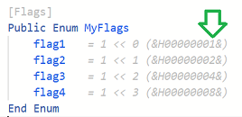

# Attributes
{: .no_toc }

Attributes have two major functions: 

- they can act as instructions to compiler to influence how code is generated, or 
- to annotate Forms, Modules, Classes, Types, Enums, Declares, and [procedures](../Gloss#procedure) i.e. Subs/Functions/Properties. 

Previously in VBx, these attributes, such as the procedure description, hidden, default member, and others, were set via hidden text the IDE's editor didn't show you, configured via the Procedure Attributes dialog or some other places. In tB, these are all visible in the code editor. The legacy ones from VBx are supported for compatibility, but new attributes use the following syntax:   
`[Attribute]` or `[Attribute(value)]`

In attributes that take an optional boolean argument, the value of the argument is taken to be **True** if no value is provided. This does not mean that the default value of the attribute is True, just that if the attribute is specified within the braces with no value, its value will be set to True. Different boolean-valued attributes have different default values. Those values apply unless the user has explicitly provided the attribute.

Multiple attributes can be specified in the same square braces, separated by comma:   
`[Attribute1, Attribute2(param), Attribute3]`

---

The available attributes are listed below in alphabetic order. Not every attribute applies to every language element. The applicability of each attribute is given below its syntax.
* TOC
{:toc}
---

## AllowUnpopulatedVtableEntry
{: #allowunpopulatedvtableentry }

Syntax: **[AllowUnpopulatedVtableEntry]**

Applicable to: [procedure](../Gloss#procedure) prototype in an [**Interface**](Interface)

Marks a prototype that a class implementing the interface is not obliged to supply.

The twinBASIC packages use it to add members to an interface without breaking code written against an earlier revision of it. `ItbHostEventsV2` extends `ItbHostEventsV1` and adds one such prototype; `ItbHostEventsV3` extends that and adds another. An addin that implements only the **V1** members still satisfies **V3**.

> [!NOTE]
> The placement is confirmed: the attribute occurs 71 times in the shipped tbIDE and VB packages, always on a prototype inside an **Interface**. Its effect is read from that usage rather than from a specification.

## AppObject  (optional Bool)
{: #appobject }

Syntax: **[AppObject** [ **( True** \| **False )** ] **]**

Applicable to: [**CoClass**](CoClass)

Legacy VB attribute: *VB_GlobalNameSpace*

Indicates the class is part of the global namespace. You should not include this attribute without a full understanding of the meaning. The **Global** class is an AppObject.

For more details, see [this VBA documentation page](https://learn.microsoft.com/en-us/openspecs/microsoft_general_purpose_programming_languages/ms-vbal/189fb41b-cc3a-4999-a6d2-ba89f72d2870).

## ArrayBoundsChecks  (optional Bool)
{: #arrayboundschecks }

Syntax: **[ArrayBoundsChecks** [ **( True** \| **False )** ] **]**

Applicable to: [**Class**](Class), [**Module**](Module), [procedure](../Gloss#procedure)

Disables or enables array element access bounds checking within the scope of a class, module, or a single procedure/method. Used on performance-critical routines.

## BindOnlyIfNoArguments  (optional Bool)
{: #bindonlyifnoarguments }

Syntax: **[BindOnlyIfNoArguments** [ **( True** \| **False )** ] **]**

Applicable to: [procedure](../Gloss#procedure)

Only binds this name to a callsite when no arguments are present. Normally false, but see below for an exception.

This attribute resolves the cases where compiler's special treatment of certain procedure names conflicts with a procedure of the same name that shouldn't be treated specially. This currently affects procedures named `Left`. Such procedures get an implicit `[BindOnlyIfNoArguments(True)]` assigned by the compiler. If the user wants to have a procedure of this name, it should include `[BindOnlyIfNoArguments(False)]`.

## BindOnlyIfStringSuffix  (optional Bool)
{: #bindonlyifstringsuffix }

Syntax: **[BindOnlyIfStringSuffix** [ **( True** \| **False )** ] **]**

Applicable to: [procedure](../Gloss#procedure)

## ClassId  (String)
{: #classid }

Syntax: **[ClassId("** 00000000-0000-0000-0000-000000000000 **")]**

Applicable to:  [**Class**](Class)

Assigns a COM CLSID to a class. For details, [see this COM documentation page](https://learn.microsoft.com/en-us/windows/win32/com/com-class-objects-and-clsids).

## ClassInterface
{: #classinterface }

twinBASIC doesn't supports this attribute directly. It supports its values under different names. See:

* [DualInterface](#dualinterface)
* [DispInterface](#dispinterface)


## CoClassCustomConstructor  (String)
{: #coclasscustomconstructor }

Syntax: **[CoClassCustomConstructor("** fully qualified path to factory method **")]**

Applicable to: [**CoClass**](CoClass)

Allows custom logic for creating and returning a new instance of the coclass' implementation.

Example:

```tb
[CoClassId("7980D953-10BF-478C-93BB-DD0093315D96")]
[CoClassCustomConstructor("FooFactory.CreateFoo")]
[COMCreatable(True)]
Public CoClass Foo
   ' ...
End CoClass
```

For an overview of coclasses in tB, see [Defining coclasses](../../Features/Language/Interfaces-CoClasses#defining-coclasses).

## CoClassId  (String)
{: #coclassid }

Syntax: **[CoClassId("** 00000000-0000-0000-0000-000000000000 **")]**

Applicable to: [**CoClass**](CoClass)

In addition to interfaces, twinBASIC also allows defining coclasses -- creatable classes that implement one or more defined interfaces. Like interfaces, these too must be in .twin files and not legacy .bas/.cls files, and must appear prior to the `Class` or `Module` statement. The generic form is:

```tb
[CoClassId("00000000-0000-0000-0000-000000000000")]
*<attributes>*
CoClass <name>
    [Default] Interface <interface name>
    *[Default, Source] Interface <event interface name>*
    *<additional Interface items>*
End CoClass
```

The methods are [procedures](../Gloss#procedure).

For an overview of coclasses in tB, see [Defining coclasses](../../Features/Language/Interfaces-CoClasses#defining-coclasses).

## COMControl  (optional Bool)
{: #comcontrol }

Syntax: **[COMControl** [ **( True** \| **False )** ] **]**

Applicable to: [**Interface**](Interface)

## COMCreatable  (optional Bool)
{: #comcreatable }

Syntax: **[COMCreatable** [ **( True** \| **False )** ] **]**

Applicable to:  [**Class**](Class), [**CoClass**](CoClass)

Indicates that this coclass can be created with the [**New**](New) keyword.

## ComExport  (optional Bool)
{: #comexport }

Syntax: **[ComExport** [ **( True** \| **False )** ] **]**

Applicable to: constants in a [**Module**](Module)

The COM counterpart of [DllExport](#dllexport), and it takes the same target: a **Public Const**, not a procedure and not a variable.

> [!NOTE]
> The placement is confirmed against the compiler: `[ComExport]` on a procedure is rejected with TB5155, while on a **Public Const** both the bare form and `[ComExport(True)]` compile. No twinBASIC package or sample uses the attribute, so what it exports is not established here.

## COMExtensible  (optional Bool)
{: #comextensible }

Syntax: **[COMExtensible** [ **( True** \| **False )** ] **]**

Applicable to: [**Interface**](Interface)

Specifies whether new members added at runtime can be called by name through an interface implementing **IDispatch**. This attribute is set to **False** by default.

## ComImport  (optional Bool)
{: #comimport }

Syntax: **[ComImport** [ **( True** \| **False )** ] **]**

Applicable to: [**Interface**](Interface)

Specifies that an interface is an import from an external COM library, for instance, the Windows shell.

## CompileIf  (Bool)
{: #compileif }

Syntax: **[CompileIf(** condition **)]**

Applicable to: [procedure definitions](../Gloss#procedure)

Controls the conditional compilation of a procedure definition. Has no default value.

## CompilerOptions  (String)
{: #compileroptions }

Syntax: **[CompilerOptions( "** options **" )]**

Applicable to: [procedure definitions](../Gloss#procedure)

Typical use would be `[CompilerOptions("+llvm,+optimize,+optimizesize")]` ⁠to compile the procedure using built-in LLVMinstead of the default compiler, with chosen optimizations. Compiler options available:

- **+llvm** - uses LLVM to compile this procedure. This feature is experimental at the moment, and cannot be used to compile functions with "complex" argument/variable types, such as objects, strings and dynamic arrays. The LLVM compiler back-end is built into twinBASIC. It is not necessary to have LLVM separately installed, and any such installation is ignored by twinBASIC.
- **+optimize** - enables optimization during compilation of this procedure
- **+optimizesize** - optimize this procedure for small code size, potentially at the expense of slower speed of the procedure
- **+optimizespeed** - optimize this procedure for fast speed, potentially at the expense of larger code size post-compilation

## ConstantFoldable  (optional Bool)
{: #constantfoldable }

Syntax: **[ConstantFoldable** [ **( True** \| **False )** ] **]**

Applicable to: [**Function**](Function) in a [**Module**](Module). The compiler rejects it on a method in a [**Class**](Class).

Specify this attribute for functions that, when called with non-variable input, can be computed at compile time rather than at runtime. For example, a function that converts a string literal to ANSI. The result never changes, so the resulting ANSI string is stored rather than recomputed on every run. Such functions are also called *pure functions*, because their output depends only on the arguments and not on the state of the program.

The restriction to modules is not an oversight. Folding a call to a method would require constant propagation through object state, and a notion of a constant object for the propagation to terminate on. twinBASIC's object model is dynamic enough to make both hard, so the compiler rejects the attribute there rather than folding a subset of cases that would be difficult to describe.

## ConstantFoldableNumericsOnly  (optional Bool)
{: #constantfoldablenumericsonly }

Syntax: **[ConstantFoldableNumericsOnly** [ **( True** \| **False )** ] **]**

Applicable to: [**Function**](Function) in a [**Module**](Module). The compiler rejects it on a method in a [**Class**](Class).

A limited case of [constant foldable attribute](#constantfoldable), which applies only if the function was called with a numeric parameter. The restriction to modules is the same one [ConstantFoldable](#constantfoldable) carries, and for the same reason.

## CustomControl  (String)
{: #customcontrol }

Syntax: **[CustomControl("** image file name **")]**

Applicable to: [**Class**](Class)

## CustomDesigner  (String)
{: #customdesigner }

Syntax: **[CustomDesigner("** designer name **")]**

Applicable to: variables in a [**Class**](Class)

Chooses which editor the IDE's property window offers for one property, instead of the editor it would otherwise pick from the property's declared type. The argument names an editor built into the IDE.

The names the twinBASIC packages use, and the properties each is applied to:

| Name | Applied to | Uses |
|---|---|---:|
| `designer_SpectrumWindows` | an **OLE_COLOR** property: **BackColor**, **ForeColor**, **MaskColor**, **BorderColor**, **FillColor**, **PaperColor** | 57 |
| `designer_SpectrumWindowsOrClear` | **TransparencyKey**, an **OLE_COLOR** in which -1 means no colour | 21 |
| `designer_IconBytes` | an icon held as **Byte()**: **MouseIconINIT**, **DragIconINIT**, **IconINIT** | 20 |
| `designer_RestrictedOLEDropMode` | **OLEDropMode** | 17 |
| `designer_MultiLineText` | a **String** property holding text that may wrap: **ToolTipTextINIT**, **Caption_INIT** | 16 |
| `designer_PictureBytes` | an image held as **Byte()**: **PictureINIT**, **PaletteINIT**, **ToolboxBitmapINIT**, **MaskPictureINIT** | 15 |
| `designer_ImageList` | an image-list reference: **Icons_INIT**, **SmallIcons_INIT**, **ColumnHeaderIcons_INIT** | 4 |
| `designer_Spectrum` | a **ColorRGBA** property | 1 |
| `designer_Grapick` | a **FillColorPoints** gradient property | 1 |
| `designer_PropertyPages` | a property-pages reference | 1 |
| `BINARY` | **InternalImages_INIT** | 1 |

> [!NOTE]
> This is a census of the 154 uses in the shipped VB, WebView2, WinNativeCommonCtls and CustomControls packages, not a published list. Other editor names may exist, and what each editor does is read from the properties it is applied to.

## Debuggable  (optional Bool)
{: #debuggable }

Syntax: **[Debuggable** [ **( True** \| **False )** ] **]**

Applicable to: [**Module**](Module), [procedure in a **Class** or **Module**](../Gloss#procedure)

When false, turns of breakpoints and stepping for the method or module. The default value is **True**.

## DebugOnly  (optional Bool)
{: #debugonly }

Syntax: **[DebugOnly** [ **( True** \| **False )** ] **]**

Applicable to: [procedure definitions](../Gloss#procedure)

Excludes calls to this procedure from the Build. They are only available when running from the IDE, i.e. debugging.

## Default
{: #default }

Syntax: **[Default]**

Applicable to: [**Interface**](Interface) declaration within a [**CoClass**](CoClass)

Marks which of a CoClass's interfaces is its default: the one a client binds to when it holds the CoClass without asking for a particular interface.

A CoClass declares one default interface, and separately one default source interface, which also carries [Source](#source):

```tb
[CoClassId("E7F3D923-475B-4367-B5EF-568FCF3A74B5")]
CoClass CustomControlTimer
    [Default] Interface _CustomControlTimer
    [Default, Source] Interface _CustomControlTimerEvents
End CoClass
```

> [!NOTE]
> The placement is confirmed: the attribute occurs 54 times across the shipped VB, VBA, VBRUN, tbIDE, AppGlobalClassObject and CustomControls packages, always on an **Interface** line inside a **CoClass**. Its effect is read from that usage.

## DefaultDesignerEvent
{: #defaultdesignerevent }

Syntax: **[DefaultDesignerEvent]**

Applicable to: [**Event**](Event) declaration in a [**Class**](Class)

Marks the one event a control nominates as its primary one. Each control that declares it declares exactly one: **Click** for **CheckBox** and **CommandButton**, **Change** for **ComboBox**, **Validate** for **Data**.

> [!NOTE]
> The placement is confirmed: the attribute occurs 37 times in the shipped VB and WinNativeCommonCtls packages, always on an **Event** in a control class, never twice in one class. Which designer action selects it is not established here.

## DefaultMember (optional Bool)

{: #defaultmember }

Syntax: **[DefaultMember** [ **(** **True** \| **False** **)** ] **]**

Applicable to: [procedure in a **Class**](../Gloss#procedure)

Default members are accessed under the instance of the object itself, without specifying their name. For example, a class that offers indexable elements may have an **Item** property that is the default member:

```tb
Class MyCollection
    [DefaultMember]
    Property Get Item(ByVal index&) As String
        ' ...
    End Property
        
    [DefaultMember]
    Property Let Item(ByVal index&, ByVal value$)
        ' ...
    End Property
End Class

Sub Example()
    Dim coll As New MyCollection
    Debug.Print "Item #3: ", coll(3)   ' Property Get Item is invoked
    coll(4) = "Item 4"                 ' Property Let Item is invoked
End Sub
```

## Description  (String) 
{: #description }

Syntax: **[Description("** arbitrary text **")]**

Applicable to: [**Class**](Class), [**CoClass**](CoClass), [**Const**](Const), [**Declare** (API declaration)](Declare), [**Interface**](Interface), [**Module**](Module), [procedure](../Gloss#procedure), [**Type** (UDT)](Type)

Provides a description in information popups in the IDE, and is exported as a `helpstring` attribute in the type library (if applicable).

The value is a **String** whose content is Markdown. The IDE renders it when it displays the popup, so headings, code spans and fenced code blocks all work. The attribute takes a single string literal, so a description running to several lines is assembled with `& vbCrLf & _` continuations, one source line per line of Markdown.

The packages that ship with twinBASIC follow a consistent shape, shown here on `CurrentProjectName` from the VBA package's `Compilation` module:

```tb
[Description("Retrieves the name of the current project as a literal string.  " & vbCrLf & _
             "### Syntax" & vbCrLf & _
             "`projectName = CurrentProjectName()`  " & vbCrLf & _
             "### Parameters" & vbCrLf & _
             "This function does not take any parameters.  " & vbCrLf & _
             "### Return value" & vbCrLf & _
             "Returns the name of the current project as a String.  " & vbCrLf & _
             "### Example" & vbCrLf & _
             "```basic" & vbCrLf & _
             "' Example: Retrieve the current project name" & vbCrLf & _
             "Dim projectName As String" & vbCrLf & _
             "projectName = CurrentProjectName()" & vbCrLf & _
             "MsgBox ""The name of this project is "" & projectName" & vbCrLf & _
             "```")]
' Note, this function uses special internal bindings and so may not behave like a regular function
Public DeclareWide PtrSafe Function CurrentProjectName Lib "<compilation>" Alias "#-33" () As String
```

Five details of that are easy to get wrong:

- **The member is a `Declare`, not an ordinary Function.** Nothing about the attribute requires that -- it is simply how this particular member happens to be written -- but it is worth reading carefully, because a description shaped like a function's is sitting on an API declaration.

- **The two spaces before several of the closing quotes are Markdown hard line breaks.** A bare newline is a soft break in Markdown and renders as a space, so removing them runs the lead sentence and the prose under each heading together into one paragraph. They appear on the prose lines only: the `###` headings and the lines inside the fenced block are already block-level and do not need them. They read as stray trailing whitespace and are easy to delete by accident.
- **A literal `"` inside the string is doubled**, as in `""The name of this project is ""`. That is ordinary twinBASIC string syntax rather than anything Markdown-specific, but it is dense enough here to be misread as part of the description.
- **The fence tag is `basic`**, which is what the IDE's Markdown renderer understands. It has nothing to do with the fence languages this documentation site highlights.
- **The section order is conventional**: a lead sentence, then `### Syntax`, `### Parameters`, `### Return value` and `### Example`. The example above keeps `### Parameters` even though the function takes none, and says so in the body.

## DispId  (Integer)
{: #dispid }

Syntax: **[DispId(** 123 **)]**

Applicable to: [procedure in an Interface](../Gloss#procedure)

Defines a dispatch ID associated with the procedure when exposed via **IDispatch**.

## DispInterface
{: #dispinterface }

Syntax: **[DispInterface]**

Applicable to: [**Interface**](Interface) in a **Library**

> [!NOTE]
> This attribute is generated in the **Library** modules that twinBASIC generates for COM references in a project. It cannot be manually created.

Indicates that the interface exposes methods via **IDispatch** late-binding. This is the default. Note that [**DualInterface**](#dualinterface) can also be specified, giving much improved performance over that of **IDispatch**-based interfaces.

## DllExport  (optional Bool)
{: #dllexport }

Syntax: **[DllExport** [ **( True** \| **False )** ] **]**

Applicable to: [procedures](../Gloss#procedure) and constants in a module.

It's possible to export a function or constant from standard modules. The compiler rejects the attribute on a module-level variable. Example:

```tb
[DllExport]
Public Const MyExportedSymbol As Long = &H00000001
```

## DLLStackCheck  (optional Bool)
{: #dllstackcheck }

Syntax: **[DLLStackCheck** [ **( True** \| **False)** ] **]**

Applicable to: [**Declare** (API declaration)](Declare)

Gives minor codegen size reduction on 32-bit API calls on the Intel platform. Has no effect on other platforms.

## DualInterface
{: #dualinterface }

Syntax: **[DualInterface]**

Applicable to: [**Interface**](Interface) in a **Library**

> [!NOTE]
>
> This attribute is generated in the **Library** modules that twinBASIC generates for COM references in a project. It cannot be manually created.

Indicates that the interface exposes methods through the OLE VTable binding. The latter has much improved performance over that of **IDispatch**-based interfaces.

## EnforceErrors  (optional Bool)
{: #enforceerrors }

Syntax: **[EnforceErrors** [ **( True** \| **False )** ] **]**

Applicable to: [procedures](../Gloss#procedure).

## EnforceWarnings  (optional Bool)
{: #enforcewarnings }

Syntax: **[EnforceWarnings** [ **( True** \| **False )** ] **]**

Applicable to: [procedures](../Gloss#procedure).

## Enumerator
{: #enumerator }

Syntax: **[Enumerator]**

Applicable to: [procedure](../Gloss#procedure) in a [**Class**](Class) or [**Interface**](Interface)

Marks the member that supplies an enumerator, which is what makes the object usable with [For Each](For-Each-Next). The member is conventionally named `_NewEnum` and returns **stdole.IUnknown** or a **Variant** wrapping one.

```tb
[Enumerator]
Public Property Get _NewEnum() As Variant
    Return InternalCollection
End Property
```

This replaces VB6's hidden `VB_UserMemId = -4` procedure attribute, which twinBASIC still accepts for compatibility.

> [!NOTE]
> The placement is confirmed: the attribute occurs 25 times in the shipped VB, VBRUN, WebView2, WinNativeCommonCtls and WinServicesLib packages, on a **Function** or a **Property Get**. The WinServicesLib use describes itself as providing "For-Each support for the services collection".

## EnumId  (String)
{: #enumid }

Syntax: **[EnumId("** 00000000-0000-0000-0000-000000000000 **")]**

Applicable to: [**Enum**](Enum)

Specifies a GUID to be associated with an enum in type libraries.

## EventInterfaceId  (String)
{: #eventinterfaceid }

Syntax: **[EventInterfaceId("** 00000000-0000-0000-0000-000000000000 **")]**

Applicable to: [**Class**](Class)

Assigns a fixed COM IID to the event interface twinBASIC generates for a class from its **Event** declarations. It is the events-side counterpart of [InterfaceId](#interfaceid), which fixes the IID of the class's own interface.

A host may cache the IID, so a generated one that changes between builds or between bitnesses breaks clients that have already stored it. That is what the TB0013 recommendation on a [COMControl](#comcontrol) interface is asking for.

> [!NOTE]
> The placement is confirmed: 19 uses in the shipped CEF package, all on a **Class**. The entry previously stated no placement at all.

## EventsUseDispInterface  (optional Bool)
{: #eventsusedispinterface }

Syntax: **[EventsUseDispInterface** [ **( True** \| **False )** ] **]**

Applicable to: [**Class**](Class)

Makes the event interface generated for the class a dispinterface, so events are raised through **IDispatch** by member id rather than through a vtable. VB6 and VBA event sinks expect a dispinterface, so a control meant to be consumed from either sets this.

> [!NOTE]
> The placement is confirmed: 88 uses in the shipped VB, WebView2, WinNativeCommonCtls and CEF packages, every one on a **Class** and every one in the bare form. The entry previously stated no placement at all.

## Flags  (optional Bool)
{: #flags }

Syntax: **[Flags** [ **( True** \| **False )** ] **]**

Applicable to: [**Enum**](Enum)

Calculate implicit enum values as a flag set (powers of 2).

> [!NOTE]
> To prevent confusion, once an explicit value is used, all remaining values after it must also be explicit)



## FloatingPointErrorChecks  (optional Bool)
{: #floatingpointerrorchecks }

Syntax: **[FloatingPointErrorChecks** [ **( True** \| **False)** ] **]**

Applicable to: [**Class**](Class), [**Module**](Module), [procedure](../Gloss#procedure)

Disables floating point error checks. Used on performance-critical routines. The default value is **True**.

## FormDesignerId  (String)
{: #formdesignerid }

Syntax: **[FormDesignerId("** 00000000-0000-0000-0000-000000000000 **")]**

Applicable to: [**Class**](Class)

## Hidden  (optional Bool)
{: #hidden }

Syntax: **[Hidden** [ **(** **True** \| **False** **)** ] **]**

Applicable to: [**Class**](Class), [**CoClass**](CoClass), [**Interface**](Interface)

Hides the interface or class from certain Intellisense and other lists.

## IdeButton  (String)
{: #idebutton }

Syntax: **[IdeButton("** caption **")]**

Applicable to: [procedure](../Gloss#procedure) definition in a module.

## IgnoreWarnings  (Warning code list)
{: #ignorewarnings }

Syntax: **[IgnoreWarnings** **(** **TBnnnn** [ **,** **TBmmmm** ]... **)** **]**

Applicable to: [**Class**](Class), [**Module**](Module), [procedure](../Gloss#procedure)

Suppresses the named warnings within the class, module or procedure the attribute is applied to. The codes are written bare, exactly as the compiler prints them, and are **not** quoted:

```tb
[IgnoreWarnings(TB0001)]
Module MD5
```

> [!NOTE]
> The placement is confirmed two ways: 113 uses in the shipped VB, CEF and WinNativeCommonCtls packages plus Sample 22, on a **Class**, a **Module** and a **Sub**; and three probes, one per target, that compile clean. Those uses between them suppress `TB0001`, `TB0020`, `TB0024` and `TB0026`. The entry previously stated no placement, and called the arguments a list of strings.

## IntegerOverflowChecks  (optional Bool)
{: #integeroverflowchecks }

Syntax: **[IntegerOverflowChecks** [ **( True** \| **False )** ] **]**

Applicable to: [**Class**](Class), [**Module**](Module), [procedure](../Gloss#procedure)

Disables integer overflow checks. Used on performance-critical routines. The default value is **True**.

## InterfaceId  (String)
{: #interfaceid }

Syntax: **[InterfaceId( "**00000000-0000-0000-0000-000000000000**" )]**

Applicable to: [**Interface**](Interface)

twinBASIC supports defining COM interfaces using BASIC syntax, rather than needing an type library with IDL and C++. These are only supported in .twin files, not in legacy .bas or .cls files. They must appear *before* the [**Class**](Class) or [**Module**](Module) statement, and will always have a project-wide scope. the The generic form for is as follows:

```tb
[InterfaceId ("00000000-0000-0000-0000-000000000000")]
*<attributes>*
Interface <name> Extends <base-interface>
    *<attributes>*
	<method 1>
	*<attributes>*
	<method 2>
	' ...
End Interface
```

The methods are [procedures](../Gloss#procedure).

For an overview of interfaces in tB, see [Defining interfaces](../../Features/Language/Interfaces-CoClasses.html#defining-interfaces).

## MustBeQualified  (optional Bool)
{: #mustbequalified }

Syntax:  **[MustBeQualified** [ **(True** \| **False )** ] **]**

Applicable to: [procedure](../Gloss#procedure)

## NonBrowsable  (optional Bool)
{: #nonbrowsable }

Syntax: **[NonBrowsable** [ **( True** \| **False )** ] **]**

Applicable to: variables and [procedures](../Gloss#procedure) in a [**Class**](Class)

Keeps a member out of the surfaces that list a class's members, while leaving it callable. The twinBASIC packages apply it to members that exist for the framework's own use, such as `InternalSectionId` and `hWndHeader`.

This is distinct from [Hidden](#hidden), which applies to a whole type, and from [Restricted](#restricted).

> [!NOTE]
> The placement is confirmed: the attribute occurs 17 times in the shipped VB and WinNativeCommonCtls packages, on module-level variables and on a **Property Get**, in both the bare and the `(True)` form. Exactly which surfaces it affects is not established here.

## OleAutomation  (optional Bool)
{: #oleautomation }

Syntax:  **[OleAutomation** [ **(True** \| **False )** ] **]**

Applicable to: [**Interface**](Interface)

Controls whether this attribute is applied in the typelibrary. This attribute is set to **True** by default.

## PackingAlignment  (Integer)
{: #packingalignment }

Syntax:  **[PackingAlignment( 1** \| **2** \| **4** \| **8** \| **16** \| **32** \| **64 )]**

Applicable to: [**Type** (UDT)](Type)

twinBASIC normally aligns objects naturally within UDTs, e.g. an 8-byte object is aligned at the 8-byte boundary relative to the beginning of the UDT. This can leave gaps between UDT fields. A tighter packing can be achieved with a smaller **PackingAlignment**:

```tb
[PackingAlignment(2)]
Private Type MyUDT
    x As Integer
    y As Long
    z As Integer
End Type
Private t As MyUDT
Debug.Assert Len(t) = 8 And LenB(t) = 8
```

You'll now find that both `Len(t)` and `LenB(t)` are 8.

> [!NOTE]
> Alignment, not packing alignment, is not set this way. Specifying 16 would not get you a 16-byte structure for `t`. twinBASIC does not currently have an equivalent for `__declspec_align(n)`, but such a feature is planned. This is rare outside kernel mode programming.

For introduction to this feature, see [Custom UDT Packing](../../Features/Language/UDTs#custom-udt-packing).

## PopulateFrom  (...)
{: #populatefrom }

Syntax: **[PopulateFrom( "json", "**internal path to .json**", "** table field **", "** name field **", "** value field **" )]**

Applicable to: [**Enum**](Enum)

Populates an **Enum** with values from a json file bundled with the project.

The path to the .json file, and the field names, are arbitrary. Thus, the json file doesn't have to be in the Resources folder within the project.

In the future, this attribute may be expanded to allow more data file types, and more context of use besides **Enum**.

For example, consider this enum declaration in a .twin file:

```tb
[PopulateFrom("json", "/Resources/MESSAGETABLE/Strings.json", "events", "name", "id")]
Enum EVENTS
End Enum
```

Then, there should be a `/Resources/MESSAGETABLE/Strings.json` file with following structure:

``` json
{
    "events": 
    [
        {
            "id": -1073610751,
            "name": "service_started",
            "LCID_0000": "%1 service started"
        },
    ],
}
```

The result is as-if we hand-typed the following **Enum** definition:

```tb
Enum EVENTS
    service_started = -1073610751
End Enum
```

## PredeclaredID  (optional Bool)
{: #predeclaredid }

Syntax: **[PredeclaredId** [ **( True** \| **False )** ] **]**

Applicable to: [**Class**](Class)

When set, a global instance of the class is created when the application starts.

This attribute is equivalent to the `VB_PredeclaredId` attribute in VBx .cls files.

## PreserveSig  (optional Bool)
{: #preservesig }

Syntax: **[PreserveSig** [ **(** **True** \| **False** **)** ] **]**

Applicable to: Method in an [Interface](Interface), [API Declarations](Declare).

Default value: **False** in an Interface, **True** in an API Declare.

In COM interfaces, the default value of this attribute is **False**, since normally methods return an HRESULT that the language hides from you. **[PreserveSig** [ **(True)** ] **]** overrides this behavior and defines the function exactly as you provide. This is necessary if you need to define it as returning something other than a 4-byte **Long**, or want to handle the result yourself, bypassing the normal runtime error raised if the return value is negative (this is helpful when a negative value indicates an expected, acceptable failure, rather than a true error, like when an enum interface is out of items).

In APIs, the default value of this attribute is `True`. So therefore, you can specify `False` to rewrite the last parameter as a return. Example:

```tb
Public Declare PtrSafe Function SHGetDesktopFolder Lib "shell32" (ppshf As IShellFolder) As Long
```

can be rewritten as

```tb
[PreserveSig(False)] 
Public Declare PtrSafe Function SHGetDesktopFolder Lib "shell32" () As IShellFolder`
```

## RedirectToStaticImplementation  (String)
{: #redirecttostaticimplementation }

Syntax: **[RedirectToStaticImplementation("** fully qualified path to a procedure **")]**

Applicable to: [procedure](../Gloss#procedure) prototype in an [**Interface**](Interface)

Supplies an implementation for an interface prototype without a class behind it: the interface declares the signature, and the named module-level procedure is what a call reaches.

The [App](../Packages/AppGlobalClassObject/) object is built this way, each of its properties naming a procedure in a private module:

```tb
Public Interface _App Extends stdole.IUnknown
    [RedirectToStaticImplementation("InternalStuff.GetAppPath")]
    Property Get Path() As String
    [RedirectToStaticImplementation("InternalStuff.GetAppEXEName")]
    Property Get EXEName() As String
End Interface
```

> [!NOTE]
> The attribute is rejected on a method in a **Class**, with TB5155. All 82 uses in the shipped AppGlobalClassObject and VB packages are inside an **Interface** -- `_App`, `_Clipboard`, `_Screen`, `_Forms` and `VBGlobal` -- on a **Property Get**, a **Function** or a **Sub**. Its effect is read from that usage.

## Restricted  (optional Bool)
{: #restricted }

Syntax: **[Restricted** [ **( True** \| **False )** ] **]**

Applicable to: [**Interface**](Interface)

Restricts the interface methods from being called in most contexts.

This is attribute has the same function as the [**restricted** MIDL attribute][MIDL restricted].

[MIDL restricted]: https://learn.microsoft.com/en-us/windows/win32/midl/restricted

## RunAfterBuild  (optional Bool)
{: #runafterbuild }

Syntax: **[RunAfterBuild** [ **( True** \| **False )** ] **]**

Applicable to: [**Function**](Function), [**Sub**](Sub)

Specifies a function that runs after your exe is built. There's `App.LastBuildPath` to know where it is if you're e.g. signing the executable.

Only one **[RunAfterBuild]** is allowed per project. A second one is a compile error.

## RunBeforeStartupObject
{: #runbeforestartupobject }

Syntax: **[RunBeforeStartupObject]**

Applicable to: [**Function**](Function) in a [**Module**](Module), returning a **Boolean**

Runs the function before the project's startup object. Returning **True** suppresses the startup object entirely; returning **False** lets startup proceed as normal.

The CEF package uses it to intercept the sub-process launches Chromium makes of the host executable, which must not run the application's own `Sub Main`:

```tb
Private Module PreSubMain
    [RunBeforeStartupObject]
    Function BeforeMain() As Boolean
        If (InStr(Command, "--type=") = 0) Then
            Return False        ' not a CEF sub process, so launch as usual
        Else
            cefPackage.InitializeCef()
            Return True         ' Sub Main / the startup form will NOT be invoked
        End If
    End Function
End Module
```

Compare [RunAfterBuild](#runafterbuild), which runs in the IDE at build time rather than in the built program.

## Serialize  (optional Bool)
{: #serialize }

Syntax: **[Serialize** [ **( True** \| **False )** ] **]**

Applicable to: variables in a [**Class**](Class)

## SetDllDirectory  (optional Bool)
{: #setdlldirectory }

Syntax: **[SetDllDirectory** [ **( True** \| **False )** ] **]**

Applicable to: [**Declare** (API declaration)](Declare), [**Module**](Module)

Allows an explicitly loaded DLL to load its own dependencies from it's load path. Also has the effect of allowing searching the app path for the DLLs in the base app's declare statements. It can be used per-declare or within a module.

## SimplerByVals  (optional Bool)
{: #simplerbyvals }

Syntax: **[SimplerByVals** [ **( True** \| **False )** ] **]**

Applicable to: [procedure](../Gloss#procedure)

## Source
{: #source }

Syntax: **[Source]**

Applicable to: [**Interface**](Interface) declaration within a [**CoClass**](CoClass)

Marks a CoClass interface as the one the CoClass raises events on, rather than one callable on it. A client implements this interface to receive the events.

Every use in the twinBASIC packages pairs it with [Default](#default) in one set of braces, which marks the interface as the CoClass's *default* source interface:

```tb
CoClass CustomControlTimer
    [Default] Interface _CustomControlTimer
    [Default, Source] Interface _CustomControlTimerEvents
End CoClass
```

The pairing is a convention rather than a requirement -- `[Source]` on its own compiles, and marks the interface as a source of events without making it the default one.

> [!NOTE]
> The placement is confirmed, but the effect rests on thin evidence: six uses, in the shipped VB, tbIDE and CustomControls packages, every one of them `[Default, Source]`.

## SpecialCompilerBinding  (Integer)
{: #specialcompilerbinding }

Syntax: **[SpecialCompilerBinding(** *n* **)]**

Applicable to: [procedure](../Gloss#procedure), [**Declare** (API declaration)](Declare)

Binds the member to one of the compiler's own internal implementations, selected by number.

> [!IMPORTANT]
> This attribute exists for the packages that ship with twinBASIC. The numbers are not a vocabulary a project can choose from: each names one behaviour already built into the compiler, and nothing says what an unlisted number does.

The entry previously gave the syntax as an optional Boolean. All six uses in the shipped VB package pass an integer instead: `(1)` and `(2)` on the `GlobalLoad` and `GlobalUnload` declares, `(3)` on a generic `Item` property, `(4)` on `IdleMessageLoopBreakpoint`, and `(254)` twice on **Form**'s `Show`, where a comment in the source says it "prevents ClassBeforeFirstMemberAccessFunc for this member".

## TestCase  (optional Bool)
{: #testcase }

Syntax: **[TestCase** [ **( True** \| **False )** ] **]**

Applicable to: [procedure](../Gloss#procedure) definition in a module.

## TestFixture  (optional Bool)
{: #testfixture }

Syntax: **[TestFixture **[ **( True** \| **False )** ] **]**

Applicable to: [**Module**](Module)

## TypeHint  (EnumType)
{: #typehint }

Syntax: **[TypeHint(** an enum type **)]**

Applicable to: [procedure](../Gloss#procedure) parameters

Allows populating Intellisense with an enum for types other than **Long**.

## Unimplemented  (optional Bool)
{: #unimplemented }

Syntax: **[Unimplemented** [ **( True** \| **False )** ] **]**

Applicable to: [procedure](../Gloss#procedure) definitions

Makes the compiler issue a warning about the procedure being unimplemented wherever it's called. You can upgrade it to an error too.

## UseGetLastError  (optional Bool)
{: #usegetlasterror }

Syntax: **[UseGetLastError** [ **( True** \| **False )** ] **]**

Applicable to: [**Declare** (API declaration)](Declare)

If the declared function indicates an error condition, the compiler won't automatically call `GetLastError` to retrieve the error code. The default value of this attribute is **True**, i.e. Declare-d functions are assumed to set `LastError` upon error.

## UserDefinedTypeIsAnAlias  (optional Bool)
{: #userdefinedtypeisanalias }

Syntax: **[UserDefinedTypeIsAnAlias** [ **( True** \| **False )** ] **]**

Applicable to:  [**Type** (UDT)](Type)

## WindowsControl  (String)
{: #windowscontrol }

Syntax: **[WindowsControl("** toolbox image path **")]** or **[WindowsControl("no_designer")]**

Applicable to: [**Class**](Class)

Marks a class as a Windows control, one the form designer can place on a form, and says which image represents it in the toolbox. Pass **"no_designer"** in place of a path for a control that should compile as a control without appearing in the toolbox.

A path is relative to the project root. Where the toolbox wants the image at several sizes, `??` in the path stands for the size and the IDE resolves it against the sizes that are present:

```tb
[WindowsControl("/miscellaneous/ICONS??/CheckBox??.png")]
```

The VB package supplies that one as `Miscellaneous/ICONS24/Checkbox24.png` and again under `ICONS30`, `ICONS32`, `ICONS36` and `ICONS40`. The lookup ignores case, which is why `Checkbox24` and `CheckBox30` both resolve.

Compare [CustomControl](#customcontrol), which takes one image path and no size placeholder.

> [!NOTE]
> The entry previously gave the syntax as an optional Boolean and stated no placement. All 44 uses in the shipped VB, WinNativeCommonCtls and CEF packages are on a **Class** and all pass a String; none uses the bare form. The `??` substitution is read from those paths and the files beside them rather than from a specification.

## WithDispatchForwarding
{: #withdispatchforwarding }

Syntax: **[WithDispatchForwarding]**

Applicable to: an [**Implements**](Implements) statement in a [**Class**](Class)

Routes late-bound calls arriving on the implemented interface to the class's own default interface. Without it, a host calling through **IDispatch** reaches the implemented interface and finds nothing there to dispatch to.

The **MyCOMAddin** sample states the consequence directly: the attribute "is needed so that late-bound calls on the IRibbonExtensibility interface get routed to our MyCOMAddin default interface. Without it, events like OnHelloWorldClicked will not fire."

```tb
[WithDispatchForwarding]
Implements IRibbonExtensibility
```

> [!NOTE]
> The placement is confirmed: the attribute occurs 44 times in the shipped VB, WebView2, WinNativeCommonCtls and CEF packages plus the MyCOMAddin sample, always on an **Implements** statement.
