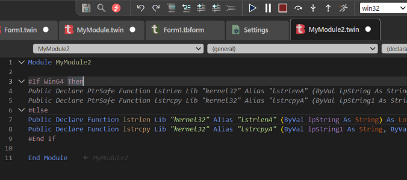
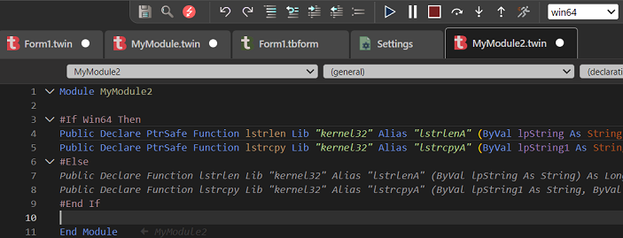

This is a guide to the built in compiler constants in twinBASIC. It includes the constants listed for VBA in its documentation even if they're not defined, as an undefined compiler constant can always be used, but will be 0.

## `Win16`

**Purpose:** Indicates a 16-bit Windows compatible platform.\
**Value:** Always 0 (False); 16 bit Windows is not supported.

## `Win32` 

**Purpose:** Indicates a 32bit compatible Windows platform\
**Value:** Always 1 (True) on supported Windows platforms, for both 32bit and 64bit.

## `Win64`

**Purpose:** Indicates a 64bit Windows AMD64 platform.\
**Value:** 0 (False) when the compiler is in 32bit mode, 1 (True) when in 64bit mode.

## `VBA6`

**Purpose:** Indicates compatibility with VBA6 syntax.\
**Value:** Always 1 (True).

## `VBA7`

**Purpose:** Indicates compatibility with VBA7 syntax.\
**Value:** Always 1 (True).

## `MAC`
**Purpose:** Indicates running on a MacOS platform.\
**Value:** Always 0 (False). Mac is not currently supported, although this will change in the future.

## `TWINBASIC`

**Purpose:** Indicates compatibility with twinBASIC syntax.\
**Value:** Always 1 (True).

## `TWINBASIC_BUILD`

**Purpose:** Provides a `Long` value giving the current twinBASIC Build Number.\
**Value:** Currently this is the same as the "BETA" number, e.g. for Beta 610 it will have a value of 610.

## `TWINBASIC_BUILD_TYPE`
**Purpose:** Allows conditional compilation based on whether the project is an exe, dll, or ocx.\
**Value:** A `String` that can be one of "Standard EXE", "Standard DLL", "ActiveX DLL", or "ActiveX Control", determined by the "Build Type" option in Project Settings.


# Usage

Usage of these follows the standard syntax of using a hashtag before the standard `If/Else/ElseIf` conditionals. For example, to differentiate between 32bit and 64bit VBA vs 64bit twinBASIC, 

``` vb
#If VBA7 Then
    'We're in either VBA7 or twinBASIC
    #If Win64 Then
        'We're in either 64bit VBA7 or 64bit twinBASIC
        #If TWINBASIC Then
            'We're in 64bit twinBASIC
            #If TWINBASIC_BUILD_TYPE = "ActiveX Control" Then
                'And we're building an OCX
            #End If
        #Else
            'We're in 64bit VBA7
        #End If
    #Else
        'We're in either 32bit VBA7 or 32bit twinBASIC
        #If TWINBASIC Then
            'We're in 32bit twinBASIC
        #Else
            'We're in 32bit VBA7
        #End If
    #End If
#Else
    'We're in VB6 or VBA6. Win64 will always be False by default. TWINBASIC will always be False by default.
#End If
```

Or more simply, to determine whether to use `PtrSafe` then `DeclareWide` or other tB features:

``` vb
#If VBA7 Then
    #If TWINBASIC Then
        'PtrSafe DeclareWide declares, if desired, also inline comments and `[ TypeHint() ]`, and function attributes.
    #Else
        'PtrSafe declares not using DeclareWide or any new syntax
    #End If
#Else
    'Classic VB6/VBA6 declares without PtrSafe or other new syntax
#End If
```

> [!IMPORTANT]
> Reminder: Compiler Constants are not `Boolean` values, so you shouuldn't use syntax like `#If Not Win64 Then` as the result may not be desired, for instance that example evaluates to `True` for both 32bit and 64bit modes when you likely used it expecting `False` under 64bit in order to use 32bit-only code.\
If you wish to treat these as `Boolean`, you can use the `CBool()` function, e.g. `#If Not CBool(Win64) Then`.

# Appearance

The tB editor has the helpful feature of showing you in real time which compiler constants are active. Code in `#If` blocks is inactive and will appear grayed out if it will not execute under current settings. Note that unlike VBx, inactive code is not evaluated for errors.

For example, in 32bit mode:\


Then switching to 64bit mode:\



---
*VB6, VBA, VBA6, and VBA7 are trademarks of the Microsoft Corporation.*\
*MacOS is a trademark of Apple, Inc.*
