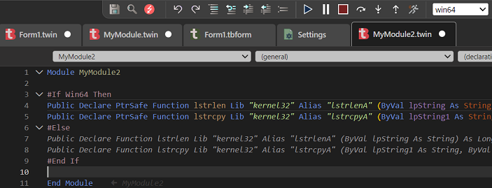

# Compiler Constants
{: .no_toc }

The constants twinBASIC predefines for conditional compilation, and how to test them with `#If`.

The list includes the constants that VBA documents, even those twinBASIC does not define: an undefined compiler constant can always be used, and its value is 0.

## Predefined constants

### `Win16`

**Purpose:** Indicates a 16-bit Windows compatible platform.\
**Value:** Always 0 (False); 16-bit Windows is not supported.

### `Win32`

**Purpose:** Indicates a 32-bit compatible Windows platform.\
**Value:** Always 1 (True) on supported Windows platforms, for both 32-bit and 64-bit.

### `Win64`

**Purpose:** Indicates a 64-bit Windows AMD64 platform.\
**Value:** 0 (False) when the compiler is in 32-bit mode, 1 (True) when in 64-bit mode.

### `VBA6`

**Purpose:** Indicates compatibility with VBA6 syntax.\
**Value:** Always 1 (True).

### `VBA7`

**Purpose:** Indicates compatibility with VBA7 syntax.\
**Value:** Always 1 (True).

### `MAC`

**Purpose:** Indicates running on a MacOS platform.\
**Value:** Always 0 (False). Mac is not currently supported, although this will change in the future.

### `TWINBASIC`

**Purpose:** Indicates compatibility with twinBASIC syntax.\
**Value:** Always 1 (True).

### `TWINBASIC_BUILD`

**Purpose:** Provides a `Long` value giving the current twinBASIC Build Number.\
**Value:** Currently this is the same as the "BETA" number, e.g. for Beta 610 it will have a value of 610.

### `TWINBASIC_BUILD_TYPE`

**Purpose:** Allows conditional compilation based on whether the project is an exe, dll, or ocx.\
**Value:** A `String` that can be one of "Standard EXE", "Standard DLL", "ActiveX DLL", or "ActiveX Control", determined by the "Build Type" option in Project Settings.

## Usage

A compiler constant is tested with `#If`, `#ElseIf` and `#Else`: the `If`, `ElseIf` and `Else` keywords with a `#` in front. For example, to tell 32-bit and 64-bit VBA apart from 64-bit twinBASIC:

```tb check_build
#If VBA7 Then
    'We're in either VBA7 or twinBASIC
    #If Win64 Then
        'We're in either 64bit VBA7 or 64bit twinBASIC
        #If TWINBASIC Then
            'We're in 64bit twinBASIC
            #If TWINBASIC_BUILD_TYPE = "ActiveX Control" Then
                'And we're building an OCX
            #End If
        #Else
            'We're in 64bit VBA7
        #End If
    #Else
        'We're in either 32bit VBA7 or 32bit twinBASIC
        #If TWINBASIC Then
            'We're in 32bit twinBASIC
        #Else
            'We're in 32bit VBA7
        #End If
    #End If
#Else
    'We're in VB6 or VBA6. Win64 will always be False by default. TWINBASIC will always be False by default.
#End If
```

Or more simply, to decide whether to use `PtrSafe`, and then `DeclareWide` or other twinBASIC features:

```tb check_build
#If VBA7 Then
    #If TWINBASIC Then
        'PtrSafe DeclareWide declares, if desired, also inline comments and `[ TypeHint() ]`, and function attributes.
    #Else
        'PtrSafe declares not using DeclareWide or any new syntax
    #End If
#Else
    'Classic VB6/VBA6 declares without PtrSafe or other new syntax
#End If
```

> [!IMPORTANT]
> Compiler constants are not `Boolean` values, so a test such as `#If Not Win64 Then` does not do what it appears to. It is `True` in both 32-bit and 64-bit mode, where the intent is usually `False` under 64-bit, to select 32-bit-only code. To treat a constant as a `Boolean`, convert it with `CBool()`, as in `#If Not CBool(Win64) Then`.

## Appearance

The twinBASIC editor shows in real time which compiler constants are active. Code in an `#If` block that will not run under the current settings is inactive, and appears greyed out. Unlike VBx, twinBASIC does not check inactive code for errors.

For example, in 32-bit mode:\


Then after switching to 64-bit mode:\



---
*VB6, VBA, VBA6, and VBA7 are trademarks of the Microsoft Corporation.*\
*MacOS is a trademark of Apple, Inc.*
