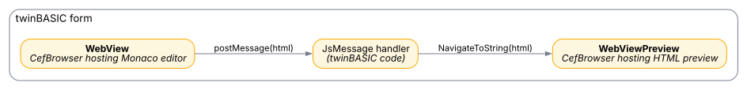

# Driving Monaco from twinBASIC

A case study combining everything from the previous tutorials: a form with **two** [**CefBrowser**](../../tB/Packages/CEF/CefBrowser/) controls --- the Microsoft Monaco editor on the left, a live HTML preview on the right. As the user types, Monaco posts the edited source to twinBASIC, which mirrors it into the preview pane.

The complete project ships as *Sample 1b --- Chromium Embedded Framework Examples* in the New-Project dialog (form *Example 3*).

## Architecture



The editor runs as a local web app under a virtual hostname; the preview pane is fed raw HTML through [**NavigateToString**](../../tB/Packages/CEF/CefBrowser/#navigatetostring).

## Runtime version requirement

Monaco uses modern JavaScript features that don't exist in older Chromium versions. The sample checks at startup and warns if the loaded runtime is too old:

```tb
If WebView.CefMajorVersion < 109 Then
    MsgBox "Sorry, Monaco is not supported by this old version of CEF."
End If
```

In practice this means **v109** or **v145** for this tutorial --- **v49** lacks the JavaScript API Monaco depends on. See [Getting started](Getting-Started) for picking the right package reference.

## Setting up the editor's assets

The Monaco editor ships as a ~2 MB collection of JavaScript, CSS, and font files. Drop them into a `Resources` sub-folder of your project --- call it `MONACO_DEMO` --- alongside an `index.html` and a small bootstrap `script.js`. The [Hosting local web assets](Hosting-Local-Web-Assets) tutorial describes the layout.

The page itself is a single `<div id='container'>` plus the bootstrap script that listens for an *initial-content* message from the host:

```html
<!DOCTYPE html>
<html>
    <head>
        <script src="/vs/loader.js"></script>
        <script src="/script.js"></script>
        <link rel="stylesheet" href="/styles.css">
    </head>
    <body>
        <div id="container"></div>
    </body>
</html>
```

```js
window.chrome.webview.addEventListener('message', (event) => {
    let initialHTML = event.data;

    require.config({ paths: { 'vs': 'https://monaco.example/vs' } });
    require(["vs/editor/editor.main"], () => {
        let editor = monaco.editor.create(document.getElementById('container'), {
            value: initialHTML,
            language: 'html',
            theme: 'vs-dark',
            minimap: { enabled: false }
        });

        editor.onDidChangeModelContent(() => {
            // Inform the host of every edit.
            window.chrome.webview.postMessage(editor.getValue());
        });
    });
});
```

## The BASIC side

Drop two `CefBrowser` controls on a form --- `WebView` (the editor) and `WebViewPreview` (the renderer). The `Ready` handler deploys the assets, registers the virtual host, and navigates:

```tb
Private localPath As String

Private Sub WebView_Ready() Handles WebView.Ready
    localPath = Environ$("USERPROFILE") & "\Documents\tbMonacoDemo"
    CopyResourcesFolderContentsToLocalPath "MONACO_DEMO", localPath

    WebView.SetVirtualHostNameToFolderMapping _
        "monaco.example", localPath & "\"
    WebView.Navigate "https://monaco.example/index.html"
End Sub
```

(`CopyResourcesFolderContentsToLocalPath` is the helper from [Hosting local web assets](Hosting-Local-Web-Assets).)

The two controls share a single helper browser process --- the first **CefBrowser** to reach [**Ready**](../../tB/Packages/CEF/CefBrowser/#ready) launches it, the second one attaches to the existing process. That sharing is what makes the two-pane pattern cheap.

## Pushing the initial content

Once Monaco has finished loading, the bootstrap script listens for a `message` event containing the HTML to seed the editor with. Fire that message after the editor's [**NavigationComplete**](../../tB/Packages/CEF/CefBrowser/#navigationcomplete):

```tb
Private Sub WebView_NavigationComplete( _
        ByVal IsSuccess As Boolean, ByVal WebErrorStatus As Long) _
        Handles WebView.NavigationComplete

    If WebView.DocumentURL <> "https://monaco.example/index.html" Then Exit Sub

    Dim initialHTML As String = _
        StrConv(LoadResData("initial-editor-html.html", "MONACO_DEMO"), vbFromUTF8)

    WebView.PostWebMessage(initialHTML)
    WebViewPreview.NavigateToString(initialHTML)
End Sub
```

[**LoadResData**](../../tB/Packages/VB/Global/#loadresdata) returns the resource bytes; `StrConv(..., vbFromUTF8)` decodes them. [**PostWebMessage**](../../tB/Packages/CEF/CefBrowser/#postwebmessage) hands the string to Monaco's `message` listener; [**NavigateToString**](../../tB/Packages/CEF/CefBrowser/#navigatetostring) seeds the preview pane with the same text rendered as HTML.

The `If` guard at the top is important --- [**NavigationComplete**](../../tB/Packages/CEF/CefBrowser/#navigationcomplete) fires for *every* navigation, including internal Monaco asset loads. Only seed the editor on the navigation to `index.html`.

## Live preview

Every keystroke in Monaco fires its `onDidChangeModelContent` callback, which `postMessage`s the new content back to BASIC. That arrives as the [**JsMessage**](../../tB/Packages/CEF/CefBrowser/#jsmessage) event --- feed it straight into the preview:

```tb
Private Sub WebView_JsMessage(ByVal Message As Variant) Handles WebView.JsMessage
    WebViewPreview.NavigateToString(Message)
End Sub
```

That's it --- the preview pane re-renders on every edit.

## Detecting a missing runtime

A reasonable fraction of users will run the application on a machine where the CEF runtime ZIP has not been installed. The [**Error**](../../tB/Packages/CEF/CefBrowser/#error) event reports this case with the exact path the control searched:

```tb
Private Sub WebView_Error(ByVal code As Long, ByVal msg As String) _
        Handles WebView.Error
    MsgBox "Failed to initialize the CEF control." & vbCrLf & vbCrLf & _
           "Code: " & Hex$(code) & vbCrLf & _
           msg, vbExclamation, "CEF"
End Sub
```

The fix is to install the matching runtime ZIP from [github.com/twinbasic/cef-runtimes](https://github.com/twinbasic/cef-runtimes/releases/), or to ship the runtime alongside the application and point [**EnvironmentOptions.BrowserExecutableFolder**](../../tB/Packages/CEF/CefBrowser/EnvironmentOptions#browserexecutablefolder) at it during the [**Create**](../../tB/Packages/CEF/CefBrowser/#create) event. See [Getting started](Getting-Started) for the install path and the ZIPs.

## Where next

- [Hosting local web assets](Hosting-Local-Web-Assets) -- the `CopyResourcesFolderContentsToLocalPath` helper and virtual-host pattern this tutorial builds on.
- [JavaScript interop](JavaScript-Interop) -- the two bridges between BASIC and JavaScript.
- [Re-entrancy](Re-entrancy) -- why the live-preview pattern is safe even though it's mostly synchronous-looking.
- [CefBrowser reference](../../tB/Packages/CEF/CefBrowser/) -- every property, method, and event.
- [Driving Monaco (WebView2)](../WebView2/Driving-Monaco) -- the parallel implementation using the [**WebView2**](../../tB/Packages/WebView2/WebView2/) control.
