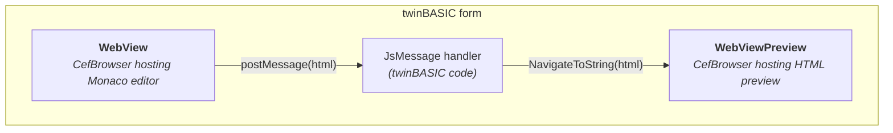

<!--
Source for Images/MonacoArchitecture.svg. Nothing in the build renders this --
the SVG beside it is a committed artifact.

Re-export with `node scripts/render_mermaid.mjs`, which reads the fenced block
below, renders it on the light Mermaid theme with the site's Inter webface
loaded, and asserts that no label overflows its node box. Do not hand-edit the
SVG's font-family: Mermaid sizes every box to the text it measured, so changing
the face without re-measuring clips every label.

The light theme is not incidental. An earlier dark-theme export put the edge
labels at rgb(204,204,204) on rgb(88,88,88) -- 4.43:1, under WCAG AA -- and the
chips had to be darkened by hand afterwards. On the light theme they measure
10.3:1 with no intervention.
-->

