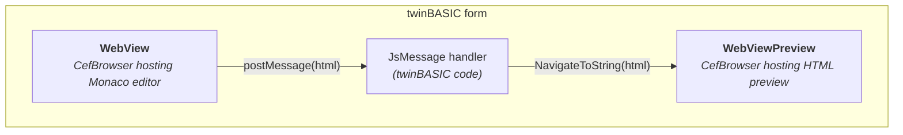

```mermaid
flowchart LR
    subgraph form["twinBASIC form"]
        direction LR
        WebView["<b>WebView</b><br/><i>CefBrowser hosting Monaco editor</i>"]
        handler["JsMessage handler<br/><i>(twinBASIC code)</i>"]
        WebViewPreview["<b>WebViewPreview</b><br/><i>CefBrowser hosting HTML preview</i>"]
        WebView -- "postMessage(html)" --> handler
        handler -- "NavigateToString(html)" --> WebViewPreview
    end
```
