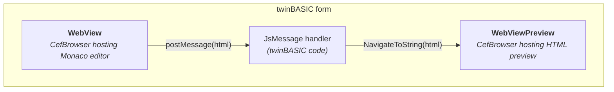

<!--
Source for Images/MonacoArchitecture.svg. Nothing in the build renders this --
the SVG beside it is a committed artifact, exported by hand.

On re-export: use the DEFAULT (light) Mermaid theme, as the WebView2 twin does.
The committed SVG came from a dark-theme export, whose edge labels read
rgb(204,204,204) on rgb(88,88,88) -- 4.43:1, under WCAG AA. The chips were
darkened by hand to rgb(68,68,68) (6.06:1); a dark-theme re-export would undo
that.
-->

