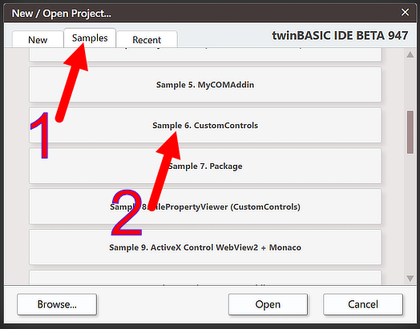
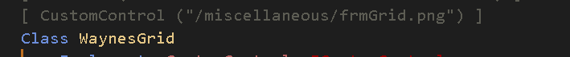
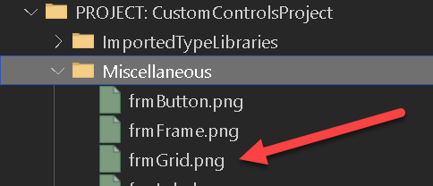
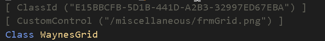
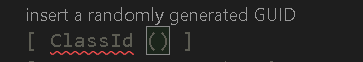

# Defining a CustomControl
A CustomControl is simply an ordinary twinBASIC class, with a few extra attributes and requirements.

> [!TIP]
> It is highly advisable to look at and experiment with the sample project provided with twinBASIC before trying to implement your own CustomControl.



***
## CustomControl() attribute


This is a required attribute for all CustomControls.  You must provide the relative path to an image file within your project that can be used to identify your control in the form designer toolbox.  We recommend that you put the image file in the Miscellaneous folder in your project.



***
##  ClassId() attribute


This is a required attribute for all CustomControls.  You must provide a unique CLSID (GUID) in order for the form engine to work with your control. 

> [!TIP]
> If you enter `[ ClassId () ]` twinBASIC helps you out - just press the 'insert a randomly generated GUID' text:



***
##  COMCreatable() attribute


This is an optional attribute, but it is usually advisable to set this attribute to False, as you don't need to instantiate CustomControls from external COM environments.

***
## Must implement ICustomControl


All CustomControls *must* implement [`CustomControls.ICustomControl`](../../tB/Packages/CustomControls/Framework/ICustomControl).  This interface currently has 3 methods that you must implement:

```tb inert=signature
Sub Initialize(ByVal Context As CustomControlContext)
```

This method is called when your control is attached to a form.  You must store the provided Context object in a class field as it offers a `Repaint()` method for informing the form engine that something in your control has changed and needs to be repainted.

```tb inert=signature
Sub Destroy()
```

This method is called when your control is detached from a form.  This allows an opportunity to break circular references so that your object instance can be destructed properly.   The implementation for this can often be left empty provided you don't create circular references in objects.

```tb inert=signature
Sub Paint(ByVal Canvas As Canvas)
```

This is the most interesting part for a CustomControl.  As such, it gets its own section, see [Painting / drawing to your control](Painting)

***
## Minimum set of properties
As twinBASIC doesn't yet support inheritance, you must expose a set of common properties (class fields) for all CustomControls:

```tb check_build slot=class project=cc-private
Public Name As String
Public Left As CustomControls.PixelCount
Public Top As CustomControls.PixelCount
Public Width As CustomControls.PixelCount
Public Height As CustomControls.PixelCount
Public Anchors As CustomControlsPackage.Anchors = New CustomControlsPackage.Anchors
Public Dock As CustomControls.DockMode
Public Visible As Boolean
```

The form designer and the form engine work with these properties, so it is important to include them in your CustomControl class. The types used here are all defined in the framework: [`PixelCount`](../../tB/Packages/CustomControls/Enumerations/PixelCount), [`DockMode`](../../tB/Packages/CustomControls/Enumerations/DockMode), and the [`Anchors`](../../tB/Packages/CustomControls/Styles/Anchors) style object.

Note that the form designer works with pixel values which are not DPI-scaled.  So the Left/Top/Width/Height properties of your control do not reflect DPI scaling.  For example, if your control has a width of 50 pixels, then at DPI 150%, then the actual drawing width is 75 pixels ( see [Painting / drawing to your control](Painting)).

***
## Must load its property values in Initialize
The property values set for your control in the form designer are loaded by your [**Initialize**](../../tB/Packages/CustomControls/Framework/ICustomControl#initialize) method.  The Context object passed to it offers a `GetSerializer()` method, and the serializer that it returns offers a `RuntimeUISrzDeserialize()` method, which copies the saved values into your control's properties:

```tb hidden concat_group=defining-initialize
' Context for the sample below: the rest of a minimal control.
[COMCreatable(False)]
Class DefiningInitializeDemo
    Implements CustomControls.ICustomControl
    Private ControlContext As CustomControls.CustomControlContext
```

```tb check_build concat_group=defining-initialize
Private Sub OnInitialize(ByVal Context As CustomControls.CustomControlContext) _
        Implements CustomControls.ICustomControl.Initialize
    If Not Context.GetSerializer.RuntimeUISrzDeserialize(Me, False) Then
        InitializeDefaultValues     ' nothing was saved yet; you implement this
    End If
    Set Me.ControlContext = Context
End Sub
```

```tb hidden concat_group=defining-initialize
    ' The helper the sample calls, and the interface's other two members.
    Private Sub InitializeDefaultValues()
    End Sub

    Private Sub OnDestroy() Implements CustomControls.ICustomControl.Destroy
    End Sub

    Private Sub OnPaint(ByVal Canvas As CustomControls.Canvas) _
            Implements CustomControls.ICustomControl.Paint
    End Sub
End Class
```

See [Property Sheet and Object Serialization](Properties) for further information, and [`SerializeInfo`](../../tB/Packages/CustomControls/Framework/SerializeInfo) for the serializer's other members --- the design-mode flag, the runtime / report mode, and the owner window handle.

***
## See also

- [CustomControls package reference](../../tB/Packages/CustomControls/) -- the full reference for the framework half (interfaces, callback objects, the [`Canvas`](../../tB/Packages/CustomControls/Framework/Canvas) drawing surface, the [`SerializeInfo`](../../tB/Packages/CustomControls/Framework/SerializeInfo) serializer) and the built-in `Waynes…` controls built on it.