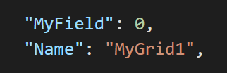
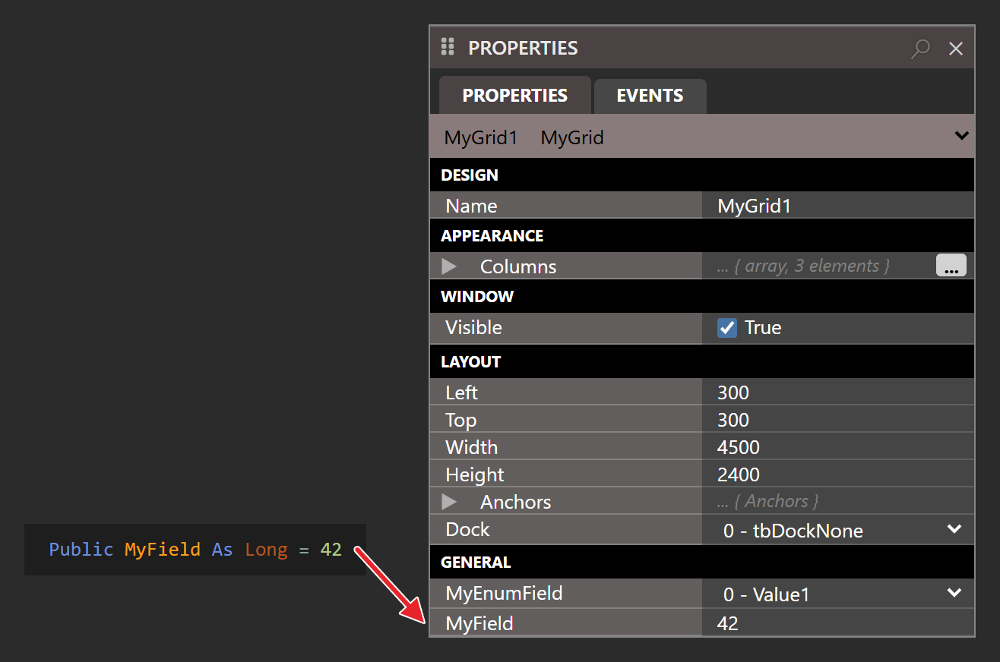
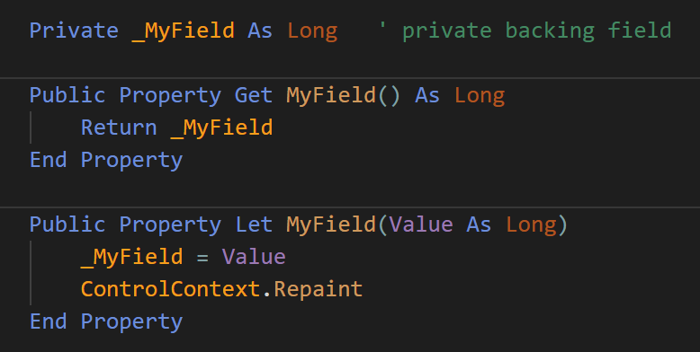
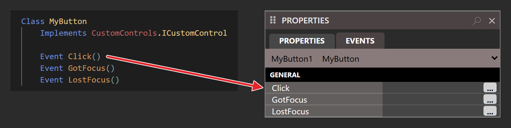

# Property Sheet and Object Serialization
The form designer property sheet will pickup any **_public_** custom properties (fields) that you expose via your CustomControl class.  For example, adding a field `Public MyField As Long` will then automatically show up in the control property sheet in the form designer:

{:width="622" height="436"}

This is then persisted to your project as properties inside your form JSON structure:



The key to making this work is your control's [**Initialize**](../../tB/Packages/CustomControls/Framework/ICustomControl#initialize) method, which loads the saved values through the serializer that its Context object provides.  It might look something like this:

```tb hidden concat_group=properties-initialize
' Context for the sample below: the rest of a minimal control.
[COMCreatable(False)]
Class PropertiesInitializeDemo
    Implements CustomControls.ICustomControl
```

```tb check_build concat_group=properties-initialize
Private Sub OnInitialize(ByVal Context As CustomControls.CustomControlContext) _
        Implements CustomControls.ICustomControl.Initialize
   If Not Context.GetSerializer.RuntimeUISrzDeserialize(Me, False) Then
      InitializeDefaultValues  ' you implement this
   End If
   ' ...
End Sub
```

```tb hidden concat_group=properties-initialize
    ' The helper the sample calls, and the interface's other two members.
    Private Sub InitializeDefaultValues()
    End Sub

    Private Sub OnDestroy() Implements CustomControls.ICustomControl.Destroy
    End Sub

    Private Sub OnPaint(ByVal Canvas As CustomControls.Canvas) _
            Implements CustomControls.ICustomControl.Paint
    End Sub
End Class
```

If `RuntimeUISrzDeserialize(Me, False)` returns `True`, then your class properties were synchronized with the properties set via the form designer.  If it returns `False` then the control has just been added to the form, and this gives you an opportunity to setup any suitable default values for your custom public properties.  The form designer notices default values you set within **Initialize**, so that your property sheet is kept in-sync.

***
## Default Values
An alternative method for setting up default values is to inline them into the class field definition:

{:width="658" height="436"}

The `RuntimeUISrzDeserialize(Me, False)` call inside your **Initialize** method will overwrite the property value if  the control is being synchronized from the persisted property sheet data.

***
## Enumerations
Enumerations that you define in your twinBASIC project are supported.  Simply expose a class field with the enumeration:

{:width="665" height="326"}

Note:  Enumerations are persisted to the form JSON structure as strings, so bare this in mind when making changes/updates to a CustomControl so that you don't introduce breaking changes by renaming an enumeration value.

***
## Objects
Class objects that you define in your twinBASIC project are supported.  You ***must*** supply a ClassId attribute for any exposed object, so that the serialization can identify it.

![A class, MyButtonState, with its ClassId attribute and four public fields of the CustomControls package's Corners, Fill, Borders and TextRendering classes, which its Sub New creates. Below it the declaration Public NormalState As MyButtonState = New MyButtonState, with an arrow to the NormalState row of the PROPERTIES panel for MyButton1. NormalState is open on Corners, BackgroundFill, Borders and TextRendering, Corners on TopLeft, TopRight, BottomLeft and BottomRight, and TopLeft on its Radius and Shape.](Images/ccMyFieldClass.png){:width="944" height="599"}

***
## Arrays
Arrays are supported.   The form designer allows for adding new elements, removing elements, and re-ordering of elements (via drag/drop).

{:width="830" height="362"}

***
## Property Get / Let
Custom property procedures are supported.  You will find that using Property Get / Let procedures is required if you want property changes to trigger repainting of your control.



Note that _**private**_ fields and properties do not form part of the serialization, and so will not appear on the property sheet.

***
## Avoid Variants
The serialization does not support Variants or generic Objects.  Always use strongly-typed datatypes.

***
## Events
Events that you define in your class are listed on the **EVENTS** tab of the PROPERTIES panel:

{:width="780" height="197"}

At the moment, the form-designer doesn't yet support code-behind-forms, so this feature is not yet complete.


> [!TIP]
> If you make changes to your CustomControl class, such as exposing new properties or changing how a control is drawn, these changes will get reflected immediately to any open form designers.  Form designers will show a 'resync' button when you return to them, once pressed the changes will be apparent.

> [!TIP]
> The serialization happens via JSON when running in the IDE, but via a binary format when running in a compiled DLL/EXE.  The `SerializeInfo` object that `GetSerializer()` returns is a different implementation when running in the IDE, but this should be transparent to you as a CustomControl implementer.

> [!TIP]
> When making changes or updates to a CustomControl always consider backwards compatibility.  For example, if you rename an exposed property, the old property values stored via the property sheet won't be deserialized to your new property.

***
## See also

- [`SerializeInfo`](../../tB/Packages/CustomControls/Framework/SerializeInfo) -- the serializer type passed to the constructor, and the rest of its members
- [CustomControls package reference](../../tB/Packages/CustomControls/) -- overview of the framework and the built-in `Waynes…` controls