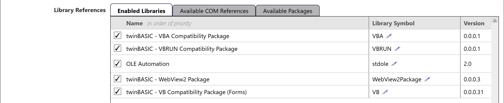
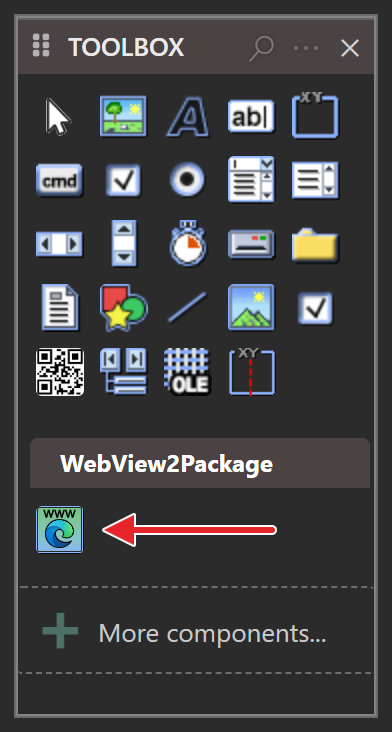
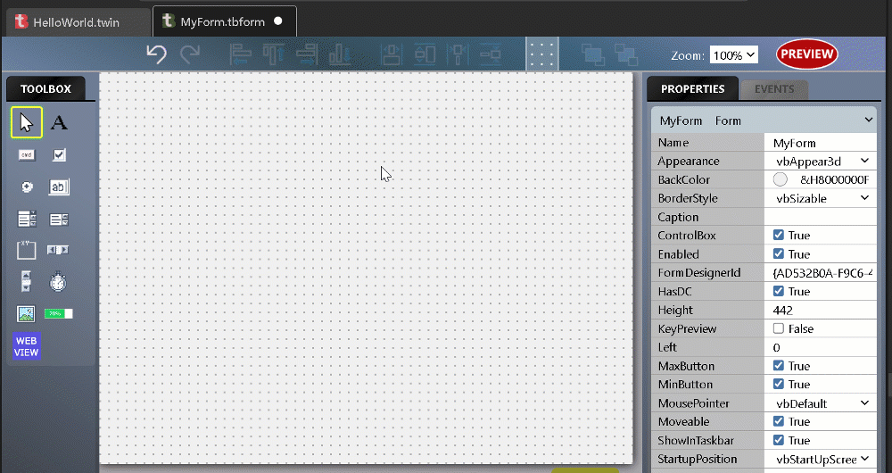
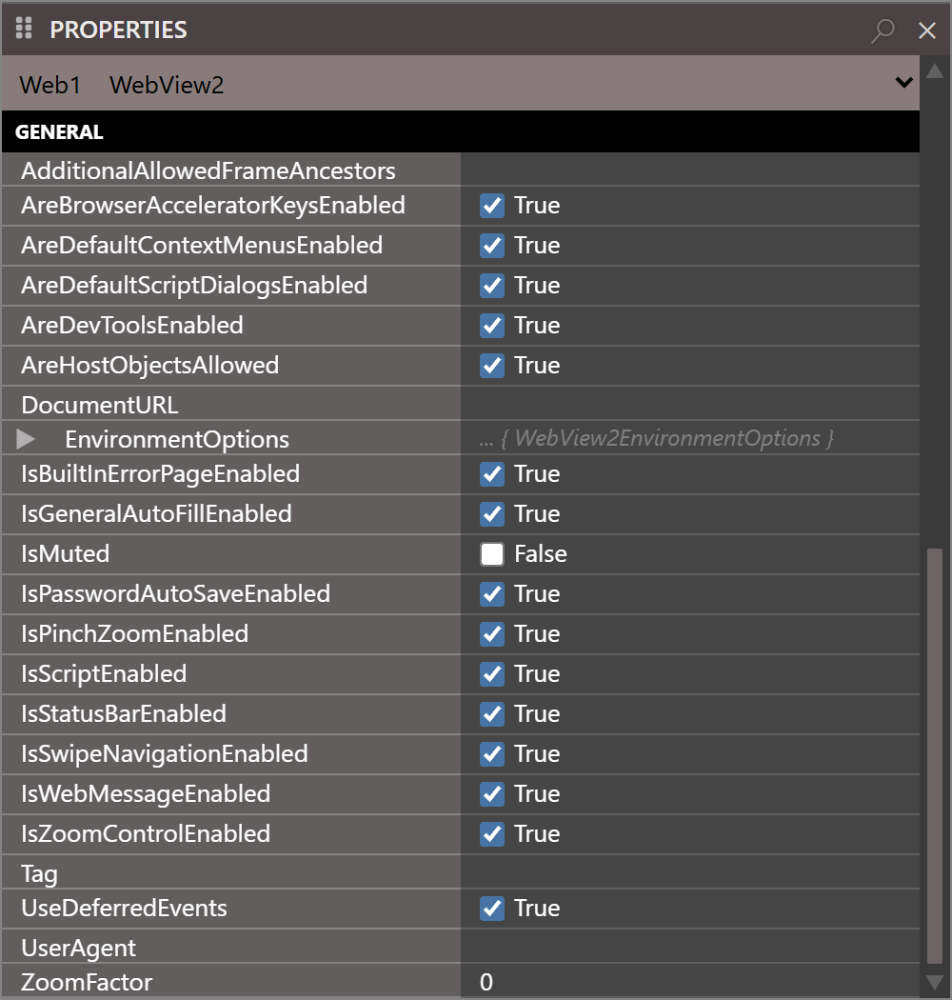
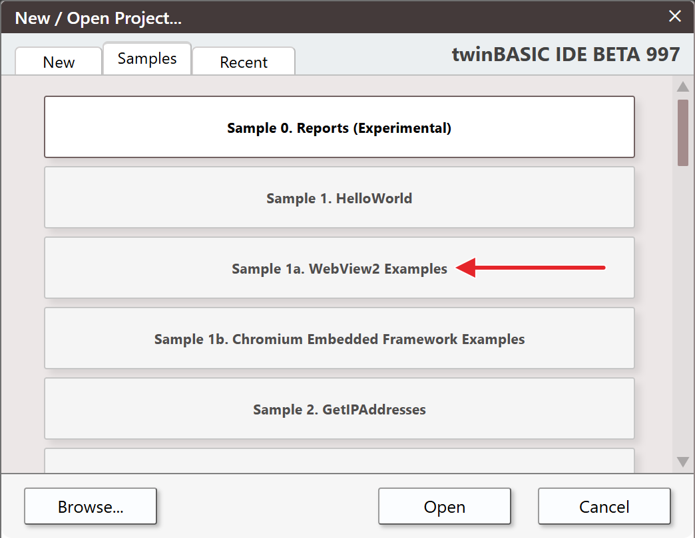

# Getting Started

## Package requirements

To create projects that use WebView2, your projects must include both the `WinNativeForms` package and the `WebView2` package in your projects.  

Both of these packages can be added through the `Project` > `References` menu option, which opens Project Settings at its Library References, and the **Available Packages** tab.  Ensure both packages are ticked, and then apply the changes and restart the compiler.

{:width="1102" height="226"}
 
 

Once you've added the package references, you should find that the WebView2 control is now available to you in the form designer:

{:width="196" height="366"}
 
 

## Create a WebView2 control on a form

We use the WebView2 control just like any ordinary control:

{:style="width:60%; height:auto;"}
 
 

## WebView2 control properties

There are lots of WebView2 properties and events to experiment with. The control's own properties are in the **GENERAL** group of the PROPERTIES panel:

{:width="500" height="525"}
 
 
For what each property does, see the [WebView2 control class](../../tB/Packages/WebView2/WebView2/); for the underlying browser feature, try searching the official <a href="https://docs.microsoft.com/en-us/microsoft-edge/webview2/">WebView2 documentation</a>

## Samples

If you prefer to start with a sample, have a look at `Sample 1a. WebView2 Examples`, available in the new-project dialog:

{:width="522" height="405"}
