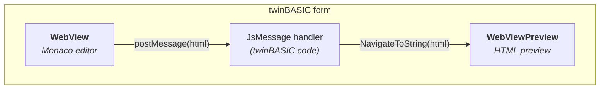

<!--
Source for Images/MonacoArchitecture.svg. Nothing in the build renders
this -- the SVG beside it is a committed artifact. Re-export with
`node scripts/render_mermaid.mjs`; see the CEF twin's source for why the
light theme and the font-loading order both matter.
-->

