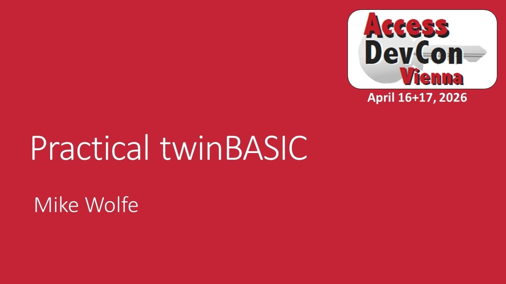
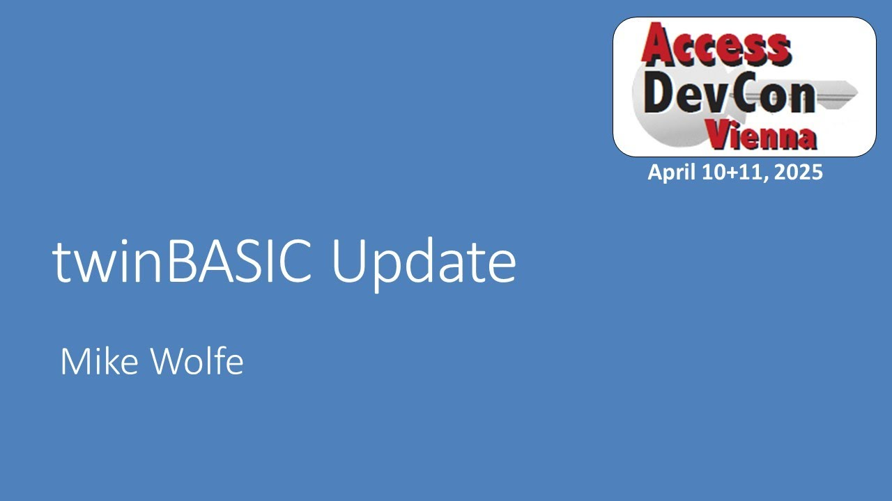
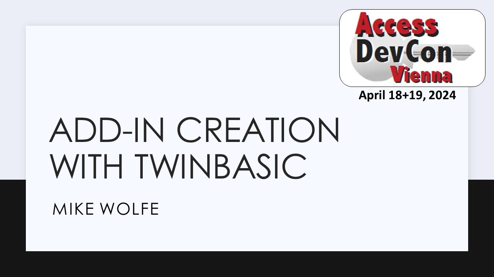
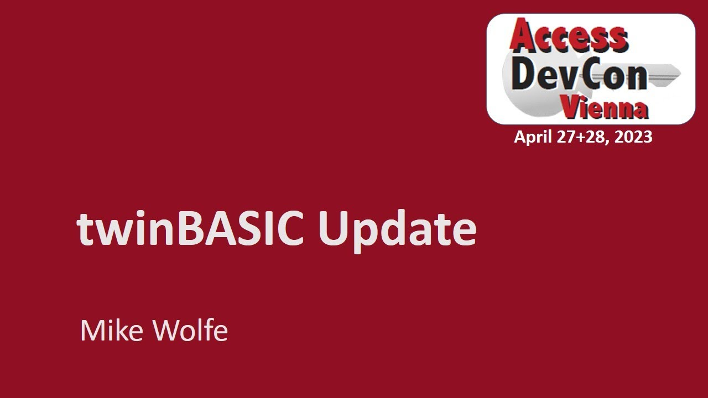
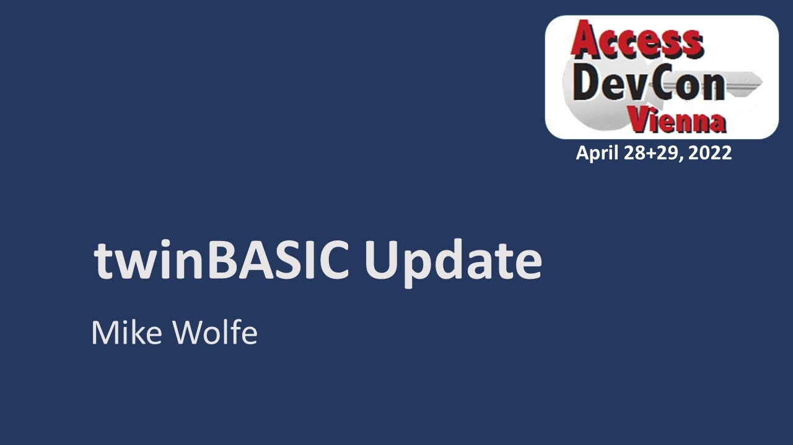
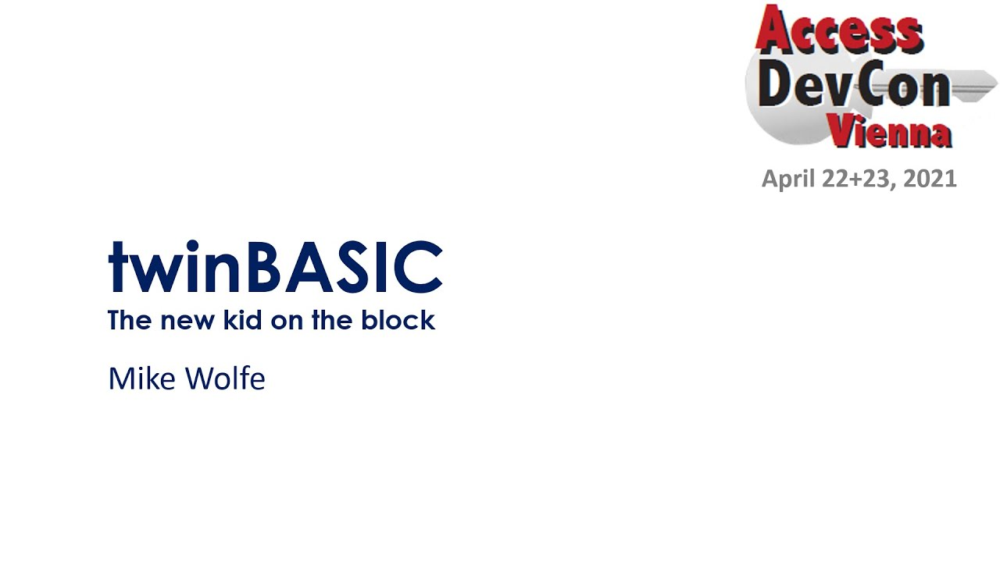

# Access DevCon - Videos

To learn more about the conference: [https://www.donkarl.com/devcon][2].

### Access DevCon 2026 - Practical twinBASIC

29 Apr 2026

{: .video-link }

 For the slide deck and project files see: https://nolongerset.com/devcon-2026/

### Access DevCon 2025 - twinBASIC Update

26 Apr 2025

{: .video-link }

Access MVP Mike Wolfe presents a twinBASIC project update. 
- For the slide deck and more information see: [https://nolongerset.com/devcon-2025][1].

[1]: https://nolongerset.com/devcon-2025
[2]: https://www.donkarl.com/devcon

---

### Access DevCon 2024 - twinBASIC

Add-In creation with twinBASIC

29 Apr 2024

{: .video-link }

Mike Wolfe presents a twinBASIC project update and how to create add-ins for Access with twinBASIC. 
- For more information see: [https://nolongerset.com/tag/twinbasic-weekly-update/][3].

[3]: https://nolongerset.com/tag/twinbasic-weekly-update/

---

### Access DevCon 2023 - twinBASIC Update

8 May 2023

{: .video-link }

Mike Wolfe presents a session on twinBASIC covering a brief project overview, progress, roadmap, demos and Access integration plans. 
- For more information see [https://nolongerset.com/tag/twinbasic][5].

[5]: https://nolongerset.com/tag/twinbasic

---

### Access DevCon 2022 - twinBASIC Update

12 May 2022

{: .video-link }

Mike Wolfe presents the current state of twinBASIC focussing on the practical use and usefulness for Access developers.
- For more information, see [https://nolongerset.com/tag/twinbasic][5]

---

### Access DevCon 2021 - twinBasic

12 May 2021

{: .video-link }

Mike Wolfe presents: The world premier of twinBasic, a new flavour of VB(A).
