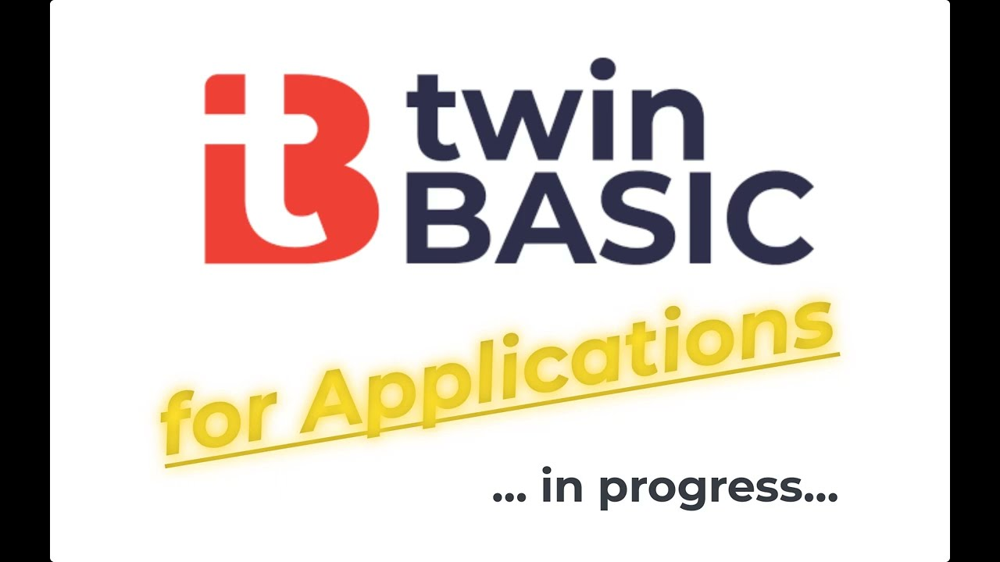
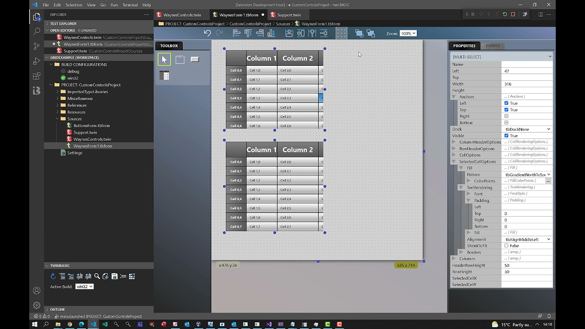
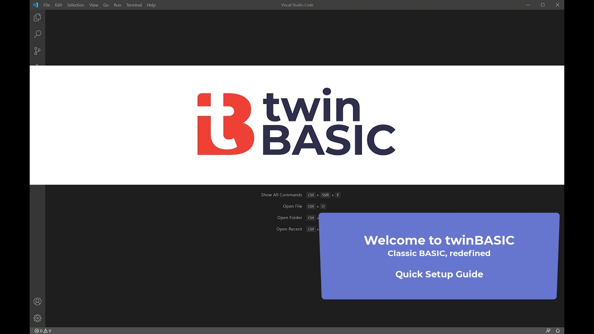
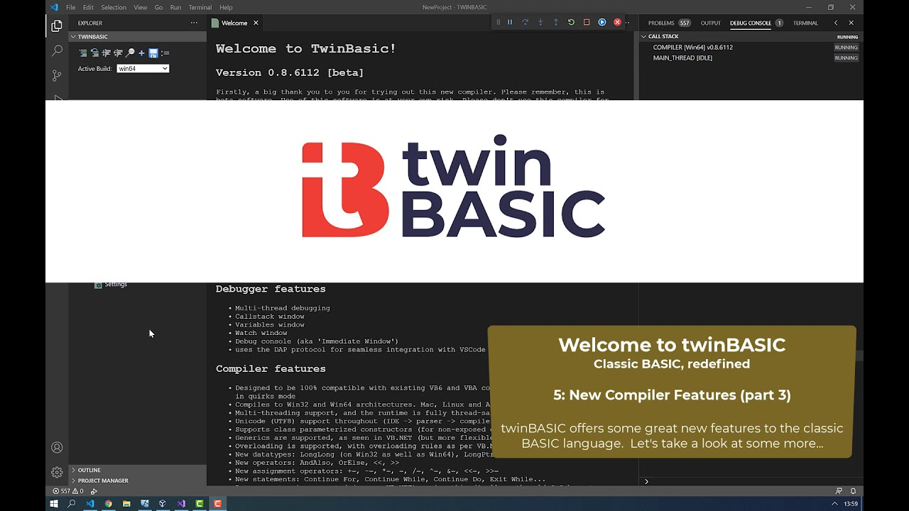
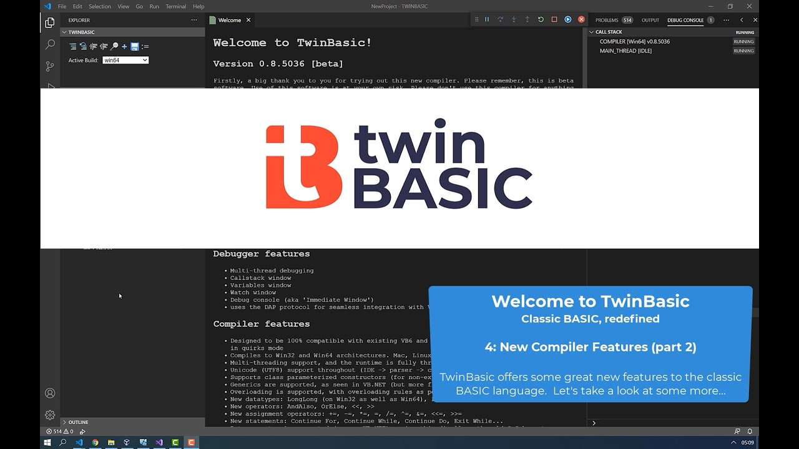
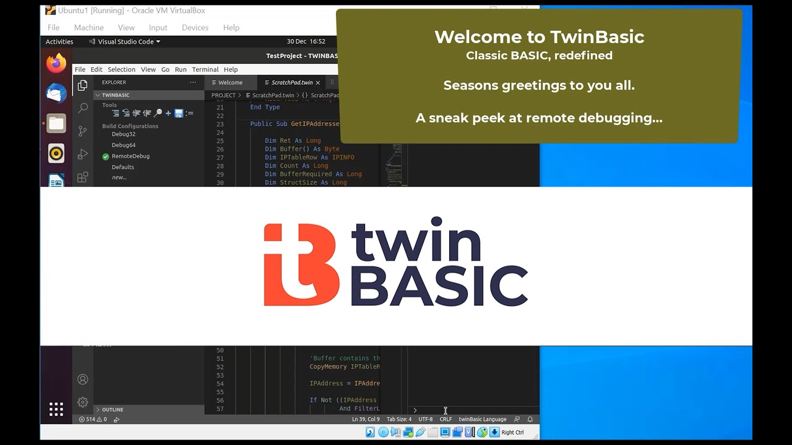
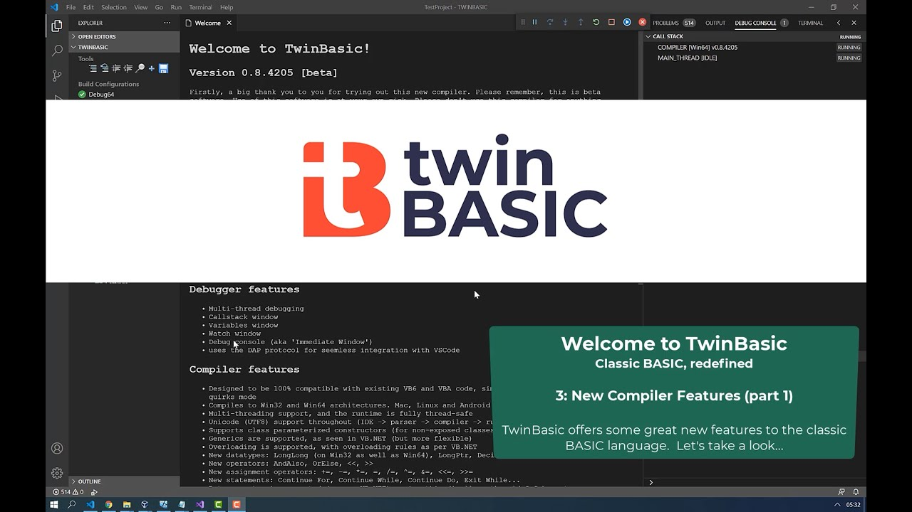
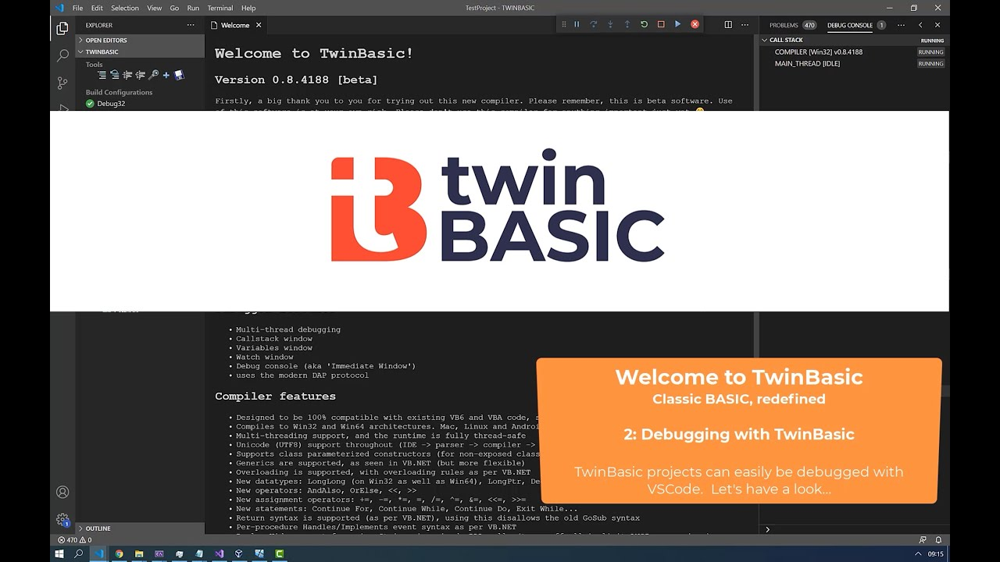
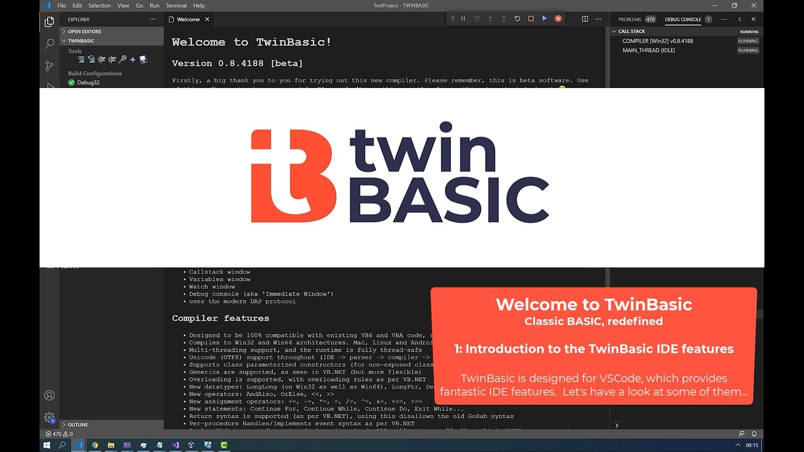

# Videos

### twinBASIC For Applications (Proof Of Concept)

22 Jul 2024

{: .video-link }

Introducing "twinBASIC for applications" -- the game-changing drop-in replacement for VBA (and VBA SDK). See our proof of concept inside MS ACCESS in action! 🚀👨‍💻👩‍💻

We posted this video on X last month but forgot to post it also on YT, so here you go :)

For more info: [https://www.reddit.com/r/vba/comments/1dg0lse/the_next_evolution_of_vba_might_be_on_the_horizon/][1]

[1]: https://www.reddit.com/r/vba/comments/1dg0lse/the_next_evolution_of_vba_might_be_on_the_horizon/

----

### twinBASIC: CustomControls and form designer sneek peek!

3 Oct 2021

{: .video-link }

A quick look at the twinBASIC form designer coming to twinBASIC very soon.   We look at the start of a grid-based CustomControl (written in twinBASIC), and also look at many of the form designer features in action.

---

### twinBASIC Preview - Quick Setup Guide (UPDATED JUNE 2021)

29 Jun 2021

{: .video-link }

twinBASIC Preview 1 is out now on the VS Code marketplace.  This setup guide will show you how to very quickly install it and start using it.  Enjoy!

---

### twinBASIC Preview - Quick Setup Guide (OLD VERSION)

10 Apr 2021

{: .video-link }
>  [!WARNING]
> This video is out of date

A lot has changed since the first release of twinBASIC, so please watch the new version of this video instead: [https://www.youtube.com/watch?v=ZzpyZWiCnzo][2].

twinBASIC Preview 1 is out now on the VS Code marketplace.  This setup guide will show you how to very quickly install it and start using it.  Enjoy!

[2]: https://www.youtube.com/watch?v=ZzpyZWiCnzo

---

### twinBASIC - New Compiler Features (part 3)

29 Jan 2021

{: .video-link }

Today we're looking at some more compiler features;  DeclareWide support (for bypassing ANSI DLL conversions), parameterized constructors and method overloading.

---

### twinBASIC - New Compiler Features (part 2)

14 Jan 2021

{: .video-link }

Today we're looking at some more compiler features, in particular: CurrentComponentName, CurrentProcedureName, RETURN syntax, IsNot operator, plus the IDE feature of 'inline parameter hints'.  What features are you most looking forward to?

---

### twinBASIC - Remote debugging applications (sneak peek)

30 Dec 2020

{: .video-link }

A little teaser video that demonstrates how easy it is to edit and debug twinBASIC projects remotely... even from different platforms like Linux!

---

### twinBASIC - New Compiler Features (part 1)

22 Dec 2020

{: .video-link }

Today we're looking at some of the new compiler features offered by twinBASIC. We look at unicode support, 64-bit support, new operators, new datatypes, assignment operators, short-circuiting operators.

---

### twinBASIC - Debugging in action (32-bit and 64-bit)

20 Dec 2020

{: .video-link }

Today we show off some of the debugging features available in twinBASIC. We feature the debug console, breakpoints, error breaking, live call stack, variables info panel, and the watch window.  We also touch on 64-bit support, showing how to switch seamlessly between them.

---

### twinBASIC - Introduction

18 Dec 2020

{: .video-link }

An introduction to twinBASIC, a new BASIC compiler that expands and improves upon VB6 and VBA code whilst giving 100% backwards compatibility with existing code.
