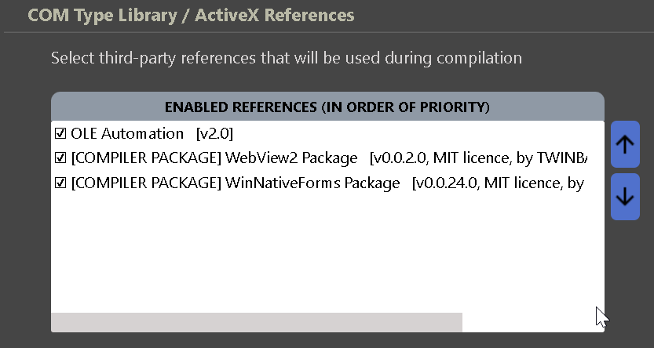
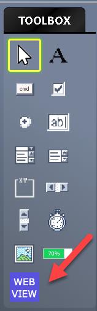
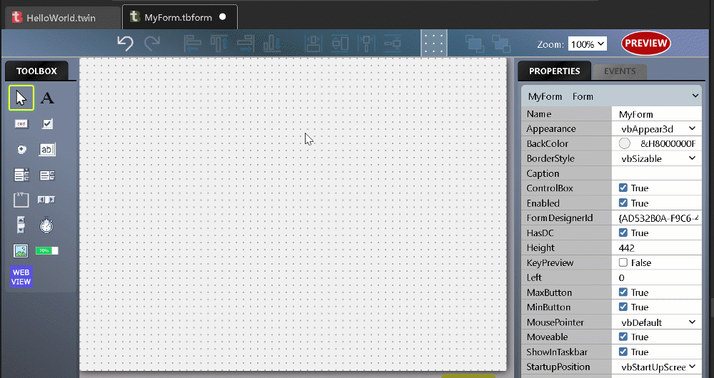
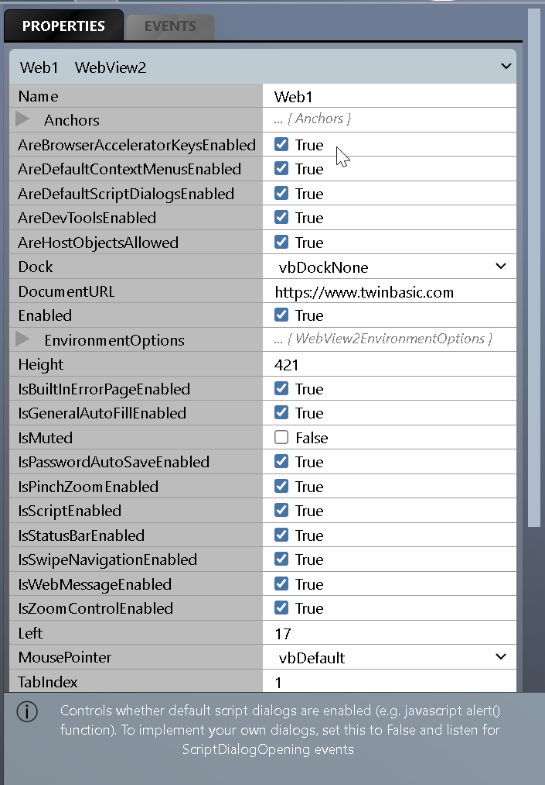
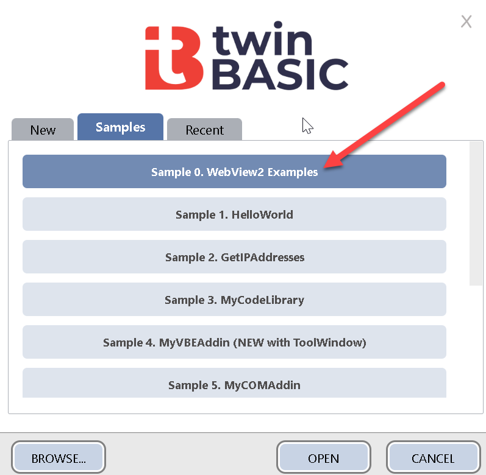

# Getting Started

## Package requirements

To create projects that use WebView2, your projects must include both the `WinNativeForms` package and the `WebView2` package in your projects.  

Both of these packages can be added through the `Project` > `References` menu option, and selecting the `TWINPACK PACKAGES` button.  Ensure both packages are ticked, and then close and save the Settings file and restart the compiler.

{:style="width:45%; height:auto;"}
 
 

Once you've added the package references, you should find that the WebView2 control is now available to you in the form designer:

{:style="width:15%; height:auto;"}
 
 

## Create a WebView2 control on a form

We use the WebView2 control just like any ordinary control:

{:style="width:60%; height:auto;"}
 
 

## WebView2 control properties

There are lots of WebView2 properties and events to experiment with.

{:style="width:45%; height:auto;"}
 
 
Note that toggling any property will show extra information at the bottom of the properties list to give you a little bit more information.  For further information on a particular property, try searching the official <a href="https://docs.microsoft.com/en-us/microsoft-edge/webview2/">WebView2 documentation</a>

## Samples

If you prefer to start with a sample, have a look at `Sample 0.  WebView2 Examples`, available in the new-project dialog:

{:style="width:45%; height:auto;"}
